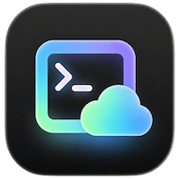
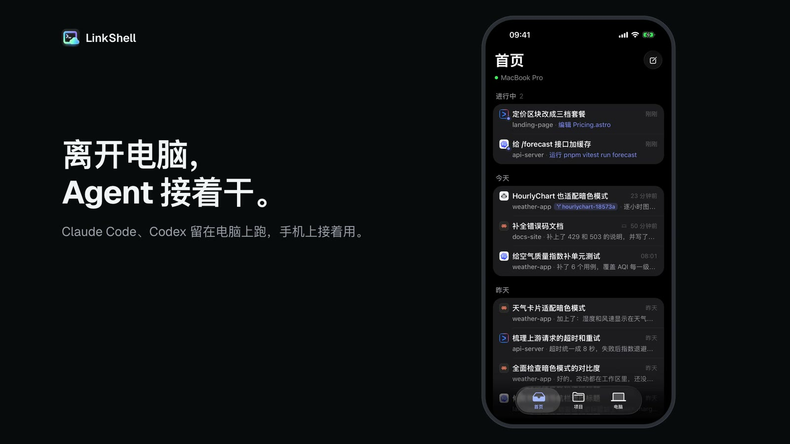
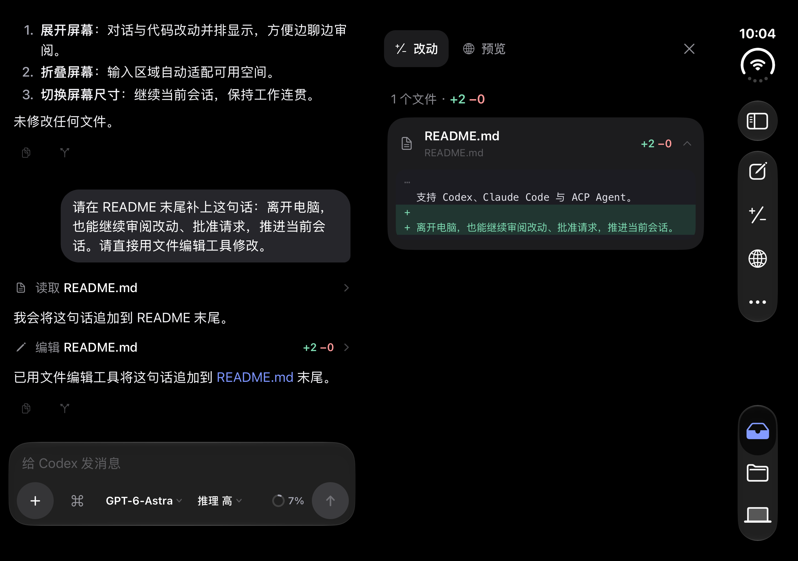
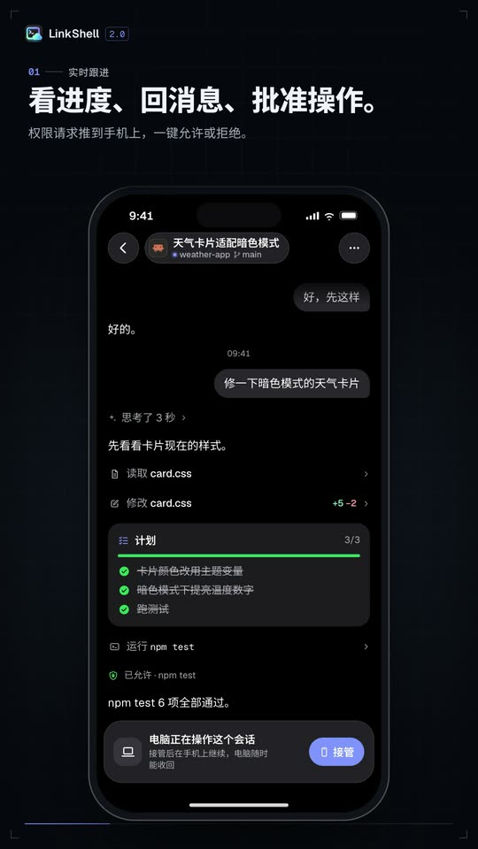
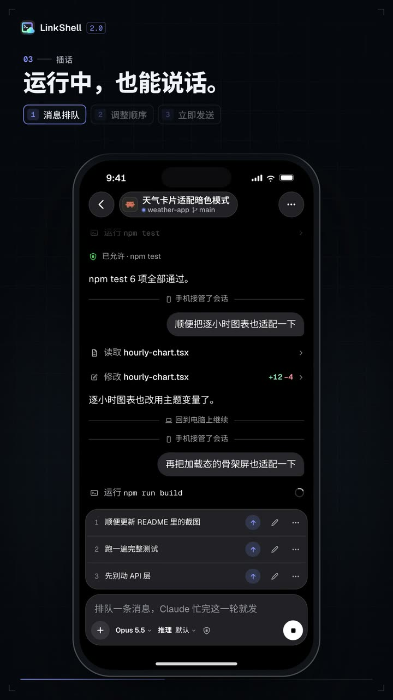
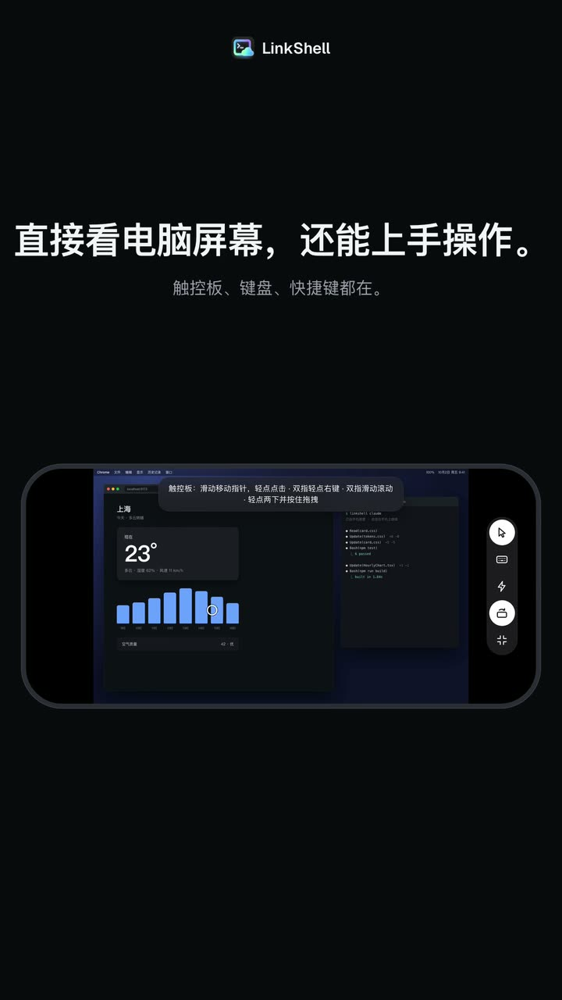
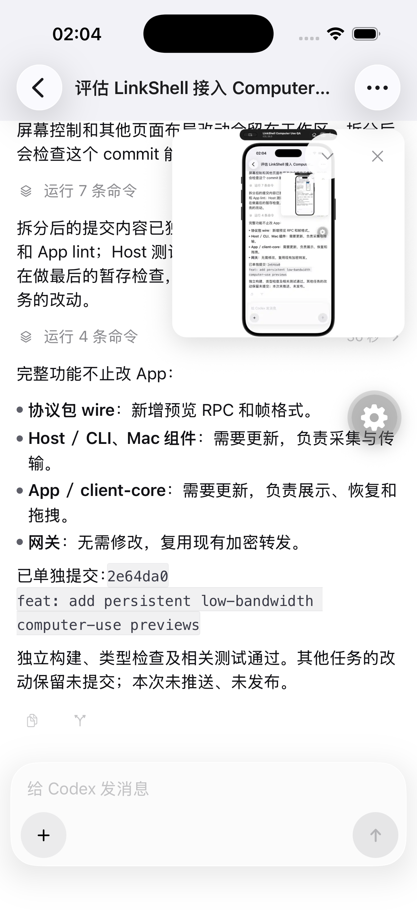

<p align="center">
  
</p>

<h1 align="center">LinkShell</h1>

<p align="center">
  <strong>Leave your desk. Your agents keep going.</strong><br />
  Follow, steer and approve the coding agents running on your computer — from your phone.
</p>

<p align="center">
  <a href="https://www.npmjs.com/package/linkshell-cli"></a>
  <a href="https://github.com/LiuTianjie/LinkShell/actions/workflows/test.yml"></a>
  <a href="LICENSE"></a>
</p>

<p align="center">
  <a href="https://liutianjie.github.io/LinkShell/">Website</a> ·
  <a href="https://liutianjie.github.io/LinkShell/docs/">Docs</a> ·
  <a href="https://apps.apple.com/cn/app/linkshell/id6761547516">iPhone</a> ·
  <a href="https://github.com/LiuTianjie/LinkShell/releases/latest">Android APK</a> ·
  <a href="README_CN.md">简体中文</a>
</p>

<p align="center">
  <a href="https://www.producthunt.com/products/linkshell?embed=true&amp;utm_source=badge-featured&amp;utm_medium=badge&amp;utm_campaign=badge-linkshell"></a>
</p>

<p align="center">
  <a href="https://liutianjie.github.io/LinkShell/assets/promo/linkshell-2.0.mp4"></a><br />
  <sub>▶ <a href="https://liutianjie.github.io/LinkShell/assets/promo/linkshell-2.0.mp4">Watch the 40-second film</a></sub>
</p>

Claude Code, Codex and other coding agents keep running on your computer. From your phone you watch them work live, send a message any time, approve what they ask for, and hand the session back to your terminal when you sit down again. Your code and the agent processes never leave your machine, and the connection is end-to-end encrypted. **Supports iPhone Duo, standard iPhones and Android.**

## Made to adapt to iPhone Duo

**Open up your workspace. Fold it and keep going.** LinkShell 2.3.7 supports iPhone Duo alongside standard iPhones.

<p align="center"></p>

- **Expanded, work side by side.** With enough space, keep the conversation beside Changes or Preview without leaving the session.
- **Folded, keep controls within reach.** The interface recognizes fold regions and adjusts to posture and orientation, reserving space for the composer and controls.
- **A standard iPhone, the same workflow.** The layout returns to an appropriate single column as space changes, keeping the current session in place.

<sub>Running app screenshot from the iPhone Duo simulator, in dark mode. [Read about adaptive layouts](https://liutianjie.github.io/LinkShell/docs/#d-iphone-duo).</sub>

## Get started

Your computer needs macOS or Linux and **Node.js 22.13 or newer**.

```bash
npm i -g linkshell-cli
linkshell setup
```

`linkshell setup` does everything once, in order: it starts the host in the background, gets the screen ready (on a Mac a LinkShell window takes you to the two permission switches and ticks them off), and connects your phone. Run it again any time; each part also has its own command.

Then connect your phone ([iPhone](https://apps.apple.com/cn/app/linkshell/id6761547516) · [Android](https://github.com/LiuTianjie/LinkShell/releases/latest)) one of two ways:

- **Pro — the official gateway.** Run `linkshell login`, then sign in to the app with the same account. The app supports GitHub and Google sign-in too. Your computer shows up by itself; no QR codes.
- **Free — your own gateway.** Run a gateway ([below](#run-your-own-gateway)), point the host at it and pair once:

  ```bash
  linkshell host --gateway wss://gw.example.com --daemon
  linkshell pair    # scan the QR code in the app: Computers → Add computer
  ```

Start sessions from the phone, or launch agents from your terminal so you can hand them over any time:

```bash
linkshell claude    # Claude Code; send from the phone to take over, press any key here to take it back
linkshell codex     # Codex; the terminal and the phone are live at the same time
```

Watching and controlling the computer's screen from the phone needs two macOS permissions. `linkshell setup` takes care of them; to do just that part, or to check it later:

```bash
linkshell screen      # macOS: a LinkShell window takes you to each switch and waits for it
```

On a Mac nothing else needs installing: the picture and the control are **LinkShell**'s, a signed app that comes with the CLI. Its two permissions (Screen Recording, Accessibility) are switches named LinkShell that you turn on once; they hold whichever terminal starts the host and across upgrades. It needs macOS 13 or later, on Apple silicon or Intel. The same installation includes both architectures; macOS selects the native one automatically. Intel real-hardware capture and performance validation is pending. On Linux the screen can be watched (not controlled) and needs `ffmpeg` with an X11 display.

<details>
<summary>Other ways to install</summary>

```bash
brew install LiuTianjie/linkshell/linkshell
curl -fsSL https://liutianjie.github.io/LinkShell/install.sh | sh
```

</details>

## What you can do

<table>
  <tr>
    <td width="33%" valign="top">
      <br />
      <strong>Watch it work, approve with a tap</strong><br />
      Replies stream word by word; plans, tool calls and diffs update live. When it needs permission, or wants you to choose, the request comes to the phone: allow or deny in one tap.
    </td>
    <td width="33%" valign="top">
      <br />
      <strong>Cut in while it is busy</strong><br />
      Messages sent mid-turn queue above the composer: reorder, take one back to rewrite, or send it now, straight into the running turn. Stop works on a turn running on the computer too. The session can have been opened in a terminal or in a desktop app.
    </td>
    <td width="33%" valign="top">
      <br />
      <strong>The computer's screen</strong><br />
      Real-time video when the two connect directly; latency depends on the Mac and network. Full screen or landscape; trackpad mode takes the mouse and keyboard (macOS 13+, Apple silicon or Intel).
    </td>
  </tr>
</table>

### Computer Use, from your phone

Ask Codex to use the browser or desktop apps on your computer, right from your phone, and preview what it is doing live in the conversation. Keep chatting and steering as you watch—no need to return to your desk.

Drag the floating preview aside, tap to enlarge it, or collapse it to an icon. The last frame stays after the turn, and the preview returns when you reopen the session. If you close it, choose “Show computer preview” from the session menu to bring it back.

Currently supports Codex on macOS with compatible Computer Use tools. See [setup and support](https://liutianjie.github.io/LinkShell/docs/#d-computer-use).

<p align="center">
  
</p>

### More features

- **Answer its questions.** Codex (including Desktop asynchronous questions), Claude, Cursor and Grok can send structured questions to your phone. Sessions show when input is needed; answer from the question card or skip. Free text is available when the agent supports it; Cursor's extension accepts choices only. See [agent question support](docs/v2/agent-questions.md).
- **Straight to your computer.** The screen and port previews travel peer to peer whenever a direct path exists (the same network, or through NAT). A Mac's screen uses low-latency H.264 hardware encoding, with the pointer drawn on the phone. Supported iOS builds default to native WebRTC decoding and Metal display, requesting a ceiling of 120 fps within display, power, thermal and network limits. Failure tries standard WebView video, then the encrypted RPC stream through the gateway, bypassing the separate direct data channel for this screen. Android and browsers use the standard viewer. The gateway retains session/signalling duties; no TURN is deployed.
- **Forks and worktrees.** Fork a session from any reply to try another direction — in the same directory or in a new git worktree that leaves your working tree alone.
- **Sub-agents, Claude Workflows and long sessions.** Follow a Workflow by phase, open each Agent's conversation and tool results, and return to a background run from the bar above the composer. The main conversation keeps a compact summary; Workflow agents stay in their run's details instead of repeating as conversation cards. Consecutive finished Agent steps fold together. The button beside the session title lists its Workflows and sub-agents. Long sessions open at their latest turns; project files are there to browse and read.
- **Commands and persistent goals.** Type `/`, tap the command button beside the composer, or open Commands from the session menu to search commands and skills without losing an unsent draft. Codex and Claude Code support `/goal` and a dedicated goal screen. Codex can pause, resume and set a token budget; Claude can set or clear a completion condition. Available controls depend on the agent installed on your computer.
- **Background tasks.** `/tasks` and the session header show commands that outlive a reply, including output, duration and exit code. Stop one Codex task independently; Claude Bash / Monitor tasks are viewable, with stopping handled on the computer. Tasks stay separate from sub-agents and Workflows and recover after reconnecting.
- **Different screen sizes.** Adaptive layouts support iPhone Duo and standard iPhones, adjusting the conversation, composer and controls to the available space.
- **A real terminal.** Terminals on your computer with a Ctrl / Esc / Tab / arrow-key bar; they keep running when you close the app. Touch scrolling retains momentum in both shell history and mouse-tracking applications such as Claude Code.
- **localhost on your phone.** Your dev server's port over the same encrypted channel, with hot reload and a full-screen mode. No open ports, no shared Wi-Fi.
- **Settings that travel.** Model, reasoning effort, permission mode, fast mode — whatever the agent offers; the phone shows what a session on the computer is really using.
- **Find a session.** Search the home page by title, latest message preview, project path, worktree branch or agent. Results include archived sessions and terminals on the selected computer.
- **Tidy sessions.** Codex rename, archive and delete update its native records; Claude rename and delete do too, while Claude and other ACP archives stay in LinkShell. Archived Codex sessions leave the active list and remain readable without being restored. Projects and sessions show the current git branch. A computer you no longer use is removed with a long press under My computers.
- **Recover session history.** Restarting the host rechecks activity instead of retaining stale running flags. Missing or unreadable history shows an explanation while preserving cached messages. See [session recovery and ACP compatibility](docs/v2/session-recovery.md).
- **Screen and files.** Watch the computer's screen, full screen and in landscape, and take the pointer and keyboard when you need to: a trackpad or tap-where-you-touch, right click, scroll, drag; a sheet of one-tap Mac shortcuts (copy, paste, switch app, Mission Control, screenshots, F-keys, and your own); and a text box for anything longer, which also takes the phone's clipboard (macOS 13+, Apple silicon or Intel; `linkshell setup` gets the permissions in place). Send photos or files from the phone into the project.

## Agents

LinkShell runs the agents already installed and signed in on your computer. It never handles their accounts or API keys.

| Agent | Mode | What you get |
| --- | --- | --- |
| **Codex** | Shared | `linkshell codex` and the phone are live at once; either side can send, interrupt and approve |
| **Claude Code** | Handoff | Claude's own UI at your desk; a message from the phone takes over, any key on the computer takes it back |
| **Gemini CLI, GitHub Copilot, OpenCode, Cursor, Grok** | Remote | Start and continue sessions from the phone over the [Agent Client Protocol](https://agentclientprotocol.com): live output, approvals, modes and models |
| **Any CLI** | Terminal | A terminal on the computer, viewed and typed into from the phone |

A Claude session opened in the Claude desktop app can be followed live and continued from the phone too. The app can't be handed a session, though: it won't show what the phone did until it is restarted. For handing a session back and forth, start it with `linkshell claude`.

What each agent supports from the phone:

| | Codex | Claude Code | Gemini, Copilot and the others |
| --- | --- | --- | --- |
| A message into a running turn | joins the turn | joins the turn | stops the turn, then runs |
| Fork a session, or from a reply | native | native | made by LinkShell: the conversation is handed over as text |
| Sessions in git worktrees | yes | yes | yes |
| Slash commands | `/compact`, `/review`, `/init`, your skills | Claude's own list and your skills | whatever the agent offers |
| Questions for you (choices, free text) | yes, including Desktop asynchronous questions | yes | Cursor choices, Grok questions, standard ACP forms |
| Plan mode | a setting on the phone | a permission mode | whatever modes the agent offers |
| Persistent goals | set, pause, resume, clear, token budget | set and clear, when `/goal` is available | not integrated |
| Background commands | status, output, stop one task | Bash / Monitor status and output | not integrated |

## Run your own gateway

A gateway only relays encrypted frames and brokers pairing, so it needs very little. Yours is the same program as the official one, without the accounts: instead of signing in, you pair each phone once, with a QR code or a six-digit code. Either:

```bash
# on a server, with the CLI
linkshell gateway --port 8787 --daemon

# or with Docker
docker run -d --name linkshell-gateway -p 8787:8787 \
  -v linkshell-gateway:/data nickname4th/linkshell-gateway
```

All it keeps is one SQLite file (public keys, and which phone is paired with which computer): `~/.linkshell/relay.db` with the CLI, `/data/relay.db` in the container, which is what the volume is for. Keep the file and phones stay paired.

On the internet, put an HTTPS reverse proxy in front (Caddy, Nginx) and use `wss://your-domain`. For use at home only, the gateway can run on the same computer: `linkshell host --gateway ws://<LAN-IP>:8787`. More in the [deployment guide](docs/deploy.md).

## Security

- **End-to-end encryption.** Phone and computer encrypt everything between them; the official gateway and yours only see ciphertext. A direct connection between the two is set up over that encrypted channel and encrypted itself.
- **Pairing grants access.** A paired phone can do what you can do in a terminal on that computer. Pair only devices you trust, and keep pairing codes to yourself.
- **Your agents, your accounts.** Agents run as your user, with your login shell's environment and their own sign-in. The Pro subscription only covers the gateway.
- **Local state.** Sessions and history are kept in `~/.linkshell` on the computer; pairings survive restarts.

## Commands

| Task | Command |
| --- | --- |
| Set a computer up, once: the host, the screen's permissions, your phone | `linkshell setup` |
| Start LinkShell in the background | `linkshell host --daemon` |
| See agents, sessions and the gateway | `linkshell host status` |
| Stop it | `linkshell host stop` |
| Pair a phone (own gateway) | `linkshell pair` |
| See or remove paired phones | `linkshell devices` / `linkshell devices remove <name>` |
| Use the official gateway (Pro) | `linkshell login` / `linkshell logout` |
| Claude Code / Codex, shareable | `linkshell claude` / `linkshell codex` (arguments pass through) |
| Run a gateway | `linkshell gateway [--port 8787] [--daemon]` |
| Set up watching and controlling the screen | `linkshell screen` |
| Check the environment | `linkshell doctor` |
| Upgrade | `linkshell upgrade` |

> **Coming from 1.x?** 2.0 changed both the app and the computer side: upgrade both and pair again. `linkshell start` and the 1.x app are no longer supported (CLI 0.10 and gateway 0.6 removed them).

## Development

A pnpm workspace; Node.js 22.13 or newer (CI uses 22).

```bash
git clone https://github.com/LiuTianjie/LinkShell.git
cd LinkShell
pnpm install
pnpm build
pnpm typecheck
pnpm lint
pnpm test
```

On macOS, the full build also builds LinkShell.app and needs Xcode's Swift toolchain. For TypeScript-only builds, use `pnpm -r --filter "./packages/*" build`; Linux CI uses this command and excludes `@linkshell/mac` from tests.

| Directory | What it is |
| --- | --- |
| `packages/wire` | Session model, JSON-RPC methods, end-to-end encryption, relay client |
| `packages/host` | The host daemon: agent drivers (Codex app-server, Claude handoff, ACP), terminals, ports, screen |
| `packages/gateway` | The gateway, official and self-hosted: the relay that routes encrypted frames and brokers pairing |
| `packages/cli` | `linkshell`: host, pairing, agent launchers, gateway, login |
| `packages/client-core` | Client state and timeline shared by the apps |
| `apps/client` | The app: Expo / React Native for iOS and Android |
| `apps/mac` | LinkShell.app (`@linkshell/mac`): the Mac side of the screen — capture, WebRTC video, input, permissions |
| `apps/client/modules/link-screen` | iOS native screen receiver: WebRTC decode, latest-frame mailbox, Metal; existing WebView controls |
| `docs/site` | Website and installer (`python3 scripts/build-site-pages.py` after editing; `scripts/site-promo-assets.sh` cuts its film and clips) |

The [remote-desktop architecture and diagrams](docs/v2/screen-realtime.md) describe the Mac/iOS media path, both WebRTC connections, fallback and validation limits. Native receiver changes require a new iOS binary; Metro reloads cannot install them. A 120 fps ceiling is not sustained display performance: stable 120 fps, stable 4K/60 and real-device weak-network gains remain unproven, and the recorded periodic stutter is still unresolved.

To work on the app, run these from the repository root in separate terminals. Give the development host its own state directory so it does not share sessions or configuration with your installed host:

```bash
LINKSHELL_HOME="$HOME/.linkshell-dev" pnpm dev:cli host --dev-port 7878
pnpm dev:app
```

Focused bug reports and pull requests are welcome. Include the CLI version, OS, agent and a minimal reproduction, and redact pairing codes and tokens. See the [release SOP](docs/release-sop.md) for publishing.

## Support the project

Sponsored by [AI18N](https://ai18n.chat/), an AI API gateway with OpenAI- and Anthropic-compatible interfaces.

<details>
<summary>Buy the author a coffee</summary>

<p>
  
  
</p>

</details>

[Product Hunt](https://www.producthunt.com/products/linkshell)

## License

[MIT](LICENSE).

The gateway also serves the browser client at its root URL. Self-hosted gateways use pairing without Supabase; the official gateway enables account access. See [Web client](apps/web/README.md).
