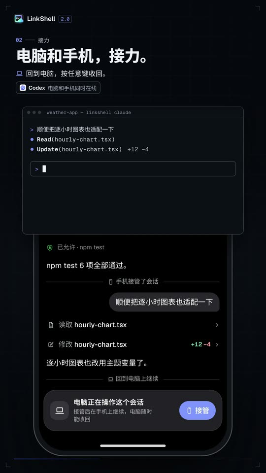
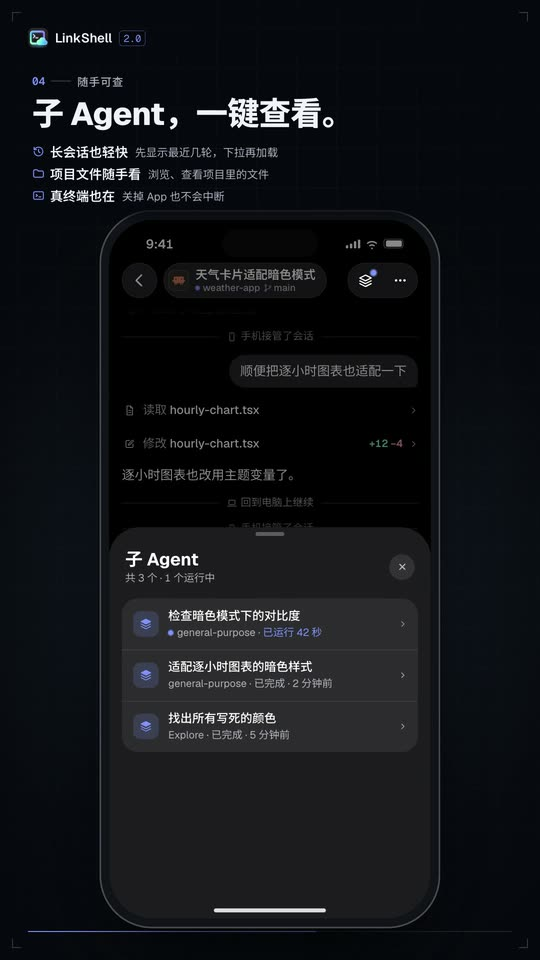
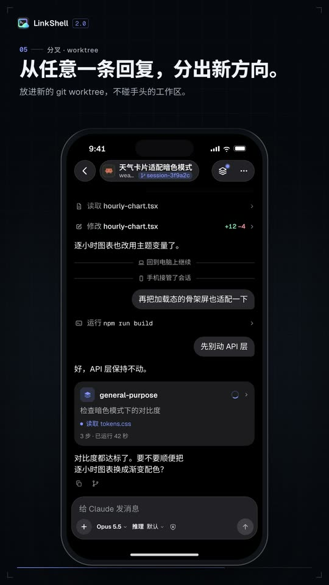
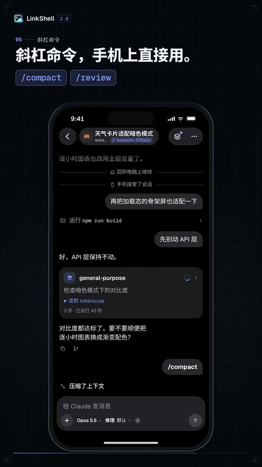

<p align="center">
  
</p>

<h1 align="center">LinkShell</h1>

<p align="center">
  <strong>Leave your desk. Your agents keep going.</strong><br />
  Follow, steer and approve the coding agents running on your computer — from your phone.
</p>

<p align="center">
  <a href="https://www.npmjs.com/package/linkshell-cli"></a>
  <a href="https://github.com/LiuTianjie/LinkShell/actions/workflows/test.yml"></a>
  <a href="LICENSE"></a>
</p>

<p align="center">
  <a href="https://liutianjie.github.io/LinkShell/">Website</a> ·
  <a href="https://liutianjie.github.io/LinkShell/docs/">Docs</a> ·
  <a href="https://apps.apple.com/cn/app/linkshell/id6761547516">iPhone</a> ·
  <a href="https://github.com/LiuTianjie/LinkShell/releases/latest">Android APK</a> ·
  <a href="README_CN.md">简体中文</a>
</p>

<p align="center">
  <a href="https://liutianjie.github.io/LinkShell/assets/promo/linkshell-2.0.mp4"></a><br />
  <sub>▶ <a href="https://liutianjie.github.io/LinkShell/assets/promo/linkshell-2.0.mp4">Watch the one-minute film</a></sub>
</p>

Claude Code, Codex and other coding agents keep running on your computer. From your phone you watch them work live, send a message any time, approve what they ask for, and hand the session back to your terminal when you sit down again. Your code and the agent processes never leave your machine, and the connection is end-to-end encrypted.

## Get started

Your computer needs macOS or Linux and **Node.js 22.13 or newer**.

```bash
npm i -g linkshell-cli
linkshell setup
```

`linkshell setup` does everything once, in order: it starts the host in the background, gets the screen ready (on a Mac a LinkShell window takes you to the two permission switches and ticks them off), and connects your phone. Run it again any time; each part also has its own command.

Then connect your phone ([iPhone](https://apps.apple.com/cn/app/linkshell/id6761547516) · [Android](https://github.com/LiuTianjie/LinkShell/releases/latest)) one of two ways:

- **Pro — the official gateway.** Run `linkshell login`, then sign in to the app with the same account. Your computer shows up by itself; no QR codes.
- **Free — your own gateway.** Run a gateway ([below](#run-your-own-gateway)), point the host at it and pair once:

  ```bash
  linkshell host --gateway wss://gw.example.com --daemon
  linkshell pair    # scan the QR code in the app: Computers → Add computer
  ```

Start sessions from the phone, or launch agents from your terminal so you can hand them over any time:

```bash
linkshell claude    # Claude Code; send from the phone to take over, press any key here to take it back
linkshell codex     # Codex; the terminal and the phone are live at the same time
```

Watching and controlling the computer's screen from the phone needs two macOS permissions. `linkshell setup` takes care of them; to do just that part, or to check it later:

```bash
linkshell screen      # macOS: a LinkShell window takes you to each switch and waits for it
```

On a Mac nothing else needs installing: the picture and the control are **LinkShell**'s, a signed app that comes with the CLI. Its two permissions (Screen Recording, Accessibility) are switches named LinkShell that you turn on once; they hold whichever terminal starts the host and across upgrades. It needs a Mac with Apple silicon, macOS 13 or later. On Linux the screen can be watched (not controlled) and needs `ffmpeg`.

<details>
<summary>Other ways to install</summary>

```bash
brew install LiuTianjie/linkshell/linkshell
curl -fsSL https://liutianjie.github.io/LinkShell/install.sh | sh
```

</details>

## What you can do

<table>
  <tr>
    <td width="33%" valign="top">
      <br />
      <strong>Hand off between desk and phone</strong><br />
      Start with <code>linkshell claude</code> in your terminal, take the session over on the phone, press any key at your desk to take it back. Codex is live on both at once.
    </td>
    <td width="33%" valign="top">
      <br />
      <strong>Follow and approve</strong><br />
      Replies stream word by word; plans, tool calls and diffs update live. Permission requests come to the phone: allow or deny in one tap.
    </td>
    <td width="33%" valign="top">
      <br />
      <strong>Talk while it works</strong><br />
      Messages sent mid-turn queue above the composer: reorder, take one back to edit, or send it now. Stop works on a turn running on the computer too.
    </td>
  </tr>
  <tr>
    <td width="33%" valign="top">
      <br />
      <strong>Everything at hand</strong><br />
      Every sub-agent a session started is one tap from its header. Long sessions open at their latest turns; project files are there to browse and read.
    </td>
    <td width="33%" valign="top">
      <br />
      <strong>Fork and worktrees</strong><br />
      Fork a session from any reply to try another direction — in the same directory or in a new git worktree that leaves your working tree alone.
    </td>
    <td width="33%" valign="top">
      <br />
      <strong>Slash commands</strong><br />
      <code>/</code> lists the agent's commands and your skills, with search. <code>/compact</code> and <code>/review</code> work for Codex from the phone too.
    </td>
  </tr>
</table>

And the rest:

- **Answer its questions.** When an agent asks you to choose or to type something — Claude's questions, Codex's, an MCP server's form — the question arrives with its options: pick, write your own answer, or skip.
- **Straight to your computer.** The screen and port previews travel peer to peer whenever a direct path exists (the same network, or through NAT); the gateway then only helps the two sides find each other. A Mac's screen then comes as real-time video (WebRTC, hardware encoded, the pointer drawn on the phone), a few tens of milliseconds behind. Without a direct path it is relayed, with a lighter picture that keeps up rather than falls behind.
- **A real terminal.** Terminals on your computer with a Ctrl / Esc / Tab / arrow-key bar; they keep running when you close the app.
- **localhost on your phone.** Your dev server's port over the same encrypted channel, with hot reload and a full-screen mode. No open ports, no shared Wi-Fi.
- **Settings that travel.** Model, reasoning effort, permission mode, fast mode — whatever the agent offers; the phone shows what a session on the computer is really using.
- **Tidy sessions.** Rename, archive and delete; for Codex and Claude this also updates their own records. Projects and sessions show the current git branch.
- **Screen and files.** Watch the computer's screen, full screen and in landscape, and take the pointer and keyboard when you need to: a trackpad or tap-where-you-touch, right click, scroll, drag; a sheet of one-tap Mac shortcuts (copy, paste, switch app, Mission Control, screenshots, F-keys, and your own); and a text box for anything longer, which also takes the phone's clipboard (macOS, Apple silicon; `linkshell setup` gets the permissions in place). Send photos or files from the phone into the project.

## Agents

LinkShell runs the agents already installed and signed in on your computer. It never handles their accounts or API keys.

| Agent | Mode | What you get |
| --- | --- | --- |
| **Codex** | Shared | `linkshell codex` and the phone are live at once; either side can send, interrupt and approve |
| **Claude Code** | Handoff | Claude's own UI at your desk; a message from the phone takes over, any key on the computer takes it back |
| **Gemini CLI, GitHub Copilot, OpenCode, Cursor, Grok** | Remote | Start and continue sessions from the phone over the [Agent Client Protocol](https://agentclientprotocol.com): live output, approvals, modes and models |
| **Any CLI** | Terminal | A terminal on the computer, viewed and typed into from the phone |

A Claude session opened in the Claude desktop app can be followed live and continued from the phone too. The app can't be handed a session, though: it won't show what the phone did until it is restarted. For handing a session back and forth, start it with `linkshell claude`.

What each agent supports from the phone:

| | Codex | Claude Code | Gemini, Copilot and the others |
| --- | --- | --- | --- |
| A message into a running turn | joins the turn | joins the turn | stops the turn, then runs |
| Fork a session, or from a reply | native | native | made by LinkShell: the conversation is handed over as text |
| Sessions in git worktrees | yes | yes | yes |
| Slash commands | `/compact`, `/review`, `/init`, your skills | Claude's own list and your skills | whatever the agent offers |
| Questions for you (choices, free text) | yes, in plan mode and outside it | yes | when the agent asks through ACP forms |
| Plan mode | a setting on the phone | a permission mode | whatever modes the agent offers |

## Run your own gateway

A gateway only relays encrypted frames and brokers pairing, so it needs very little. Yours is the same program as the official one, without the accounts: instead of signing in, you pair each phone once, with a QR code or a six-digit code. Either:

```bash
# on a server, with the CLI
linkshell gateway --port 8787 --daemon

# or with Docker
docker run -d --name linkshell-gateway -p 8787:8787 \
  -v linkshell-gateway:/data nickname4th/linkshell-gateway
```

All it keeps is one SQLite file (public keys, and which phone is paired with which computer): `~/.linkshell/relay.db` with the CLI, `/data/relay.db` in the container, which is what the volume is for. Keep the file and phones stay paired.

On the internet, put an HTTPS reverse proxy in front (Caddy, Nginx) and use `wss://your-domain`. For use at home only, the gateway can run on the same computer: `linkshell host --gateway ws://<LAN-IP>:8787`. More in the [deployment guide](docs/deploy.md).

## Security

- **End-to-end encryption.** Phone and computer encrypt everything between them; the official gateway and yours only see ciphertext. A direct connection between the two is set up over that encrypted channel and encrypted itself.
- **Pairing grants access.** A paired phone can do what you can do in a terminal on that computer. Pair only devices you trust, and keep pairing codes to yourself.
- **Your agents, your accounts.** Agents run as your user, with your login shell's environment and their own sign-in. The Pro subscription only covers the gateway.
- **Local state.** Sessions and history are kept in `~/.linkshell` on the computer; pairings survive restarts.

## Commands

| Task | Command |
| --- | --- |
| Start LinkShell in the background | `linkshell host --daemon` |
| See agents, sessions and the gateway | `linkshell host status` |
| Stop it | `linkshell host stop` |
| Pair a phone (own gateway) | `linkshell pair` |
| See or remove paired phones | `linkshell devices` / `linkshell devices remove <name>` |
| Use the official gateway (Pro) | `linkshell login` / `linkshell logout` |
| Claude Code / Codex, shareable | `linkshell claude` / `linkshell codex` (arguments pass through) |
| Run a gateway | `linkshell gateway [--port 8787] [--daemon]` |
| Set up watching and controlling the screen | `linkshell screen` |
| Check the environment | `linkshell doctor` |
| Upgrade | `linkshell upgrade` |

> **Coming from 1.x?** 2.0 changed both the app and the computer side: upgrade both and pair again. `linkshell start` and the 1.x app are no longer supported (CLI 0.10 and gateway 0.6 removed them).

## Development

A pnpm workspace; Node.js 22 (CI uses 22).

```bash
git clone https://github.com/LiuTianjie/LinkShell.git
cd LinkShell
pnpm install
pnpm build
pnpm test
```

| Directory | What it is |
| --- | --- |
| `packages/wire` | Session model, JSON-RPC methods, end-to-end encryption, relay client |
| `packages/host` | The host daemon: agent drivers (Codex app-server, Claude handoff, ACP), terminals, ports, screen |
| `packages/gateway` | The gateway, official and self-hosted: the relay that routes encrypted frames and brokers pairing |
| `packages/cli` | `linkshell`: host, pairing, agent launchers, gateway, login |
| `packages/client-core` | Client state and timeline shared by the apps |
| `apps/client` | The app: Expo / React Native for iOS and Android |
| `apps/mac` | LinkShell.app (`@linkshell/mac`): the Mac side of the screen — capture, WebRTC video, input, permissions |
| `docs/site` | Website and installer (`python3 scripts/build-site-pages.py` after editing; `scripts/site-promo-assets.sh` cuts its film and clips) |

To work on the app, run a host with a local API next to Metro:

```bash
cd packages/cli && npx tsx src/index.ts host --dev-port 7878
pnpm --filter @linkshell/client start
```

Focused bug reports and pull requests are welcome. Include the CLI version, OS, agent and a minimal reproduction, and redact pairing codes and tokens. See the [release SOP](docs/release-sop.md) for publishing.

## Support the project

Sponsored by [AI18N](https://ai18n.chat/), an AI API gateway with OpenAI- and Anthropic-compatible interfaces.

<details>
<summary>Buy the author a coffee</summary>

<p>
  
  
</p>

</details>

[Product Hunt](https://www.producthunt.com/products/linkshell)

## License

[MIT](LICENSE).
