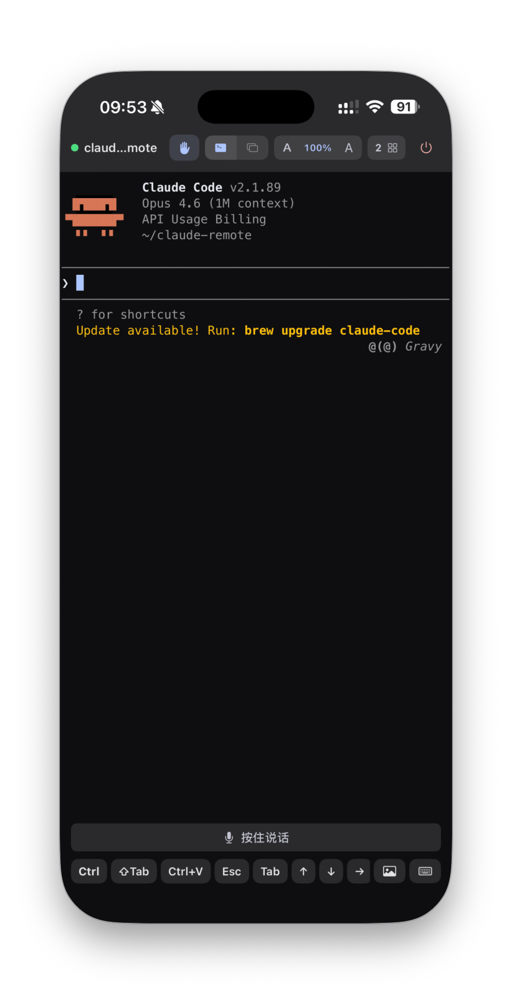
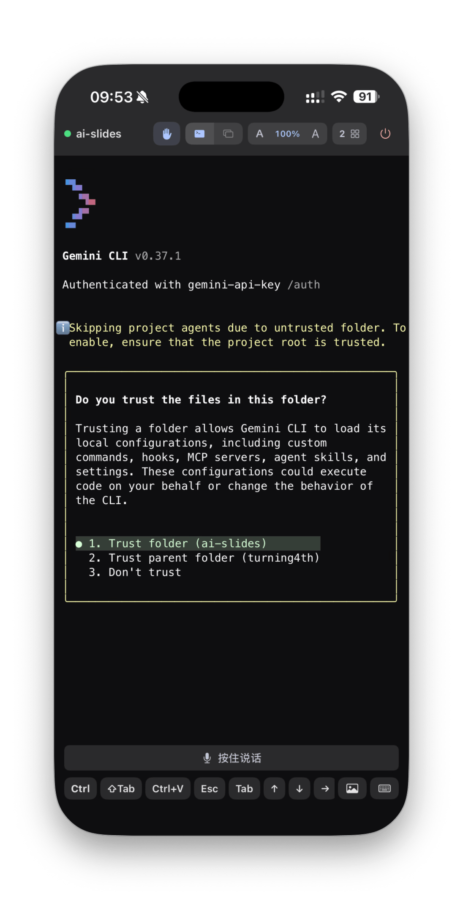
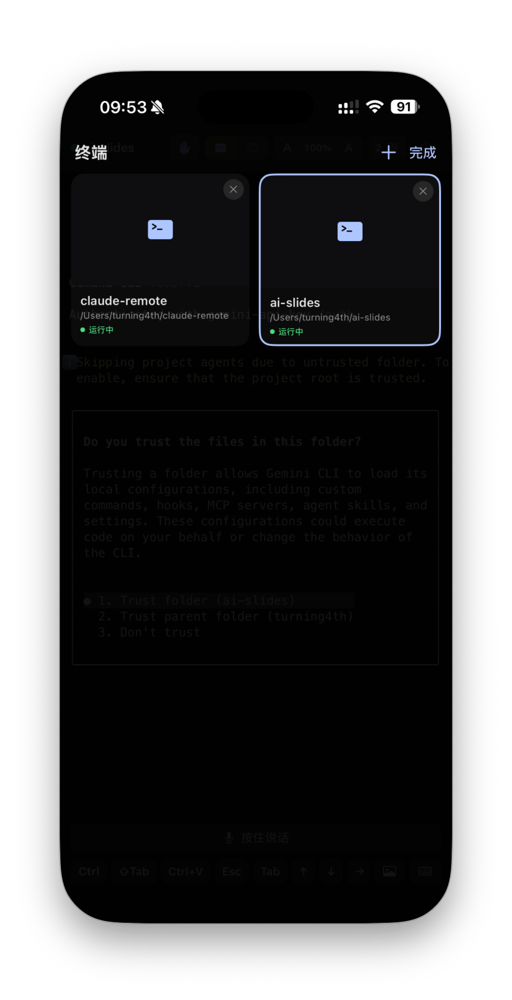
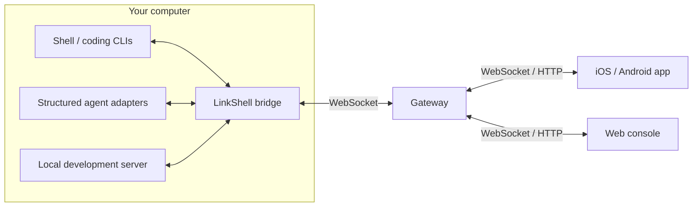

<p align="center">
  
</p>

<h1 align="center">LinkShell</h1>

<p align="center">
  <strong>Leave your desk. Keep your workspace.</strong><br />
  Your local terminals, coding agents, and development previews — on your phone or in a browser.
</p>

<p align="center">
  <a href="https://www.npmjs.com/package/linkshell-cli"></a>
  <a href="https://github.com/LiuTianjie/LinkShell/actions/workflows/test.yml"></a>
  <a href="LICENSE"></a>
</p>

<p align="center">
  <a href="https://liutianjie.github.io/LinkShell/">Website</a> ·
  <a href="https://apps.apple.com/cn/app/linkshell/id6761547516">iOS app</a> ·
  <a href="https://github.com/LiuTianjie/LinkShell/releases/latest">Android APK</a> ·
  <a href="docs/deploy.md">Self-hosting</a> ·
  <a href="README_CN.md">简体中文</a>
</p>

<p align="center">
  
  
  
</p>

LinkShell connects you to work running on your own computer. Continue a terminal session, review a coding agent's progress, respond to supported approval requests, or open a local development server from your phone.

The CLI runs a terminal bridge and an embedded gateway. Pair a client to that gateway and your workspace is reachable over the network. For access across networks, use a self-hosted gateway or the optional hosted service. Your code and agent processes keep running on the host machine.

## Get connected

Install Node.js and any coding CLI you want to use on the host. Then, from your project directory:

```bash
npm install -g linkshell-cli
linkshell start --daemon
```

1. Open the [iOS app](https://apps.apple.com/cn/app/linkshell/id6761547516) or [Android app](https://github.com/LiuTianjie/LinkShell/releases/latest) on the same network.
2. Scan the QR code printed by the CLI, or enter the gateway address and pairing code.
3. Use the terminal, or select an available provider in **Agent Workspace**.

Prefer a browser? Open the gateway URL shown by the CLI and pair there. The web console ships with the CLI and is served by the gateway.

The terminal starts your default shell. Run `claude`, `codex`, `gemini`, `copilot`, or another installed command inside it. Agent Workspace is enabled by default and detects supported Claude Code and Codex installations.

> Upgrading from an older guide? `--provider claude` and the other named terminal providers are deprecated. Use the default shell, or `--command <executable>` to launch a specific program. `--agent-provider` separately selects a structured Agent Workspace provider.

<details>
<summary>Other installation methods</summary>

Homebrew on macOS:

```bash
brew install LiuTianjie/linkshell/linkshell
```

Shell installer:

```bash
curl -fsSL https://liutianjie.github.io/LinkShell/install.sh | sh
```

</details>

## One connection, four views

| View | What you can do |
| --- | --- |
| **Terminal** | Interact with real host PTYs through xterm.js, switch terminals, and run your existing CLI tools |
| **Agent Workspace** | Read structured conversations, tool activity, plans, and file changes; respond to input and approval requests supported by the provider |
| **Browser** | Preview a host development server through HTTP and WebSocket forwarding, including HMR |
| **Desktop** | View the host display when screen sharing is enabled, using WebRTC with a screenshot-stream fallback |

The CLI can stay in the background while clients disconnect and reconnect. On macOS it prevents **idle system sleep** by default while the bridge runs, without keeping the display on. The host still needs to remain running and network-reachable.

### Agent Workspace

Supported providers expose their capabilities to the client: models, reasoning effort, permission modes, image/text input, tool events, and session history. Availability depends on the selected provider and its installed version.

| Agent | Terminal | Structured workspace |
| --- | --- | --- |
| Claude Code | Run `claude` in the shell | Claude Agent SDK; stream-json fallback when available |
| Codex | Run `codex` in the shell | Codex app-server |
| Gemini CLI, GitHub Copilot CLI, and other tools | Run the installed command in the shell | No equivalent structured adapter is promised |

```bash
# Automatically detect supported agents
linkshell start --daemon

# Select the Codex workspace explicitly
linkshell start --daemon --agent-provider codex

# Foreground terminal bridge with the Agent Workspace disabled
linkshell start --no-agent-ui
```

Other discovered local agents may appear in the session tree; discovery does not turn their terminal sessions into structured conversations. Without a supported provider, the terminal remains available.

Claude's stream-json fallback does not provide interactive tool approvals. Use the SDK path when you need permission-gated control; the UI's available controls follow the active adapter's capabilities.

### Preview a development server

Start the server in the host terminal, for example with `npm run dev`. In the app's **Browser** view, enter its port, such as `3000`.

LinkShell forwards HTTP assets and WebSocket traffic, so supported development servers can retain hot reload. The app offers mobile/desktop viewport modes and a full-screen preview. [Gateway deployment and proxy setup](docs/deploy.md).

### View your desktop

Install `ffmpeg` on the host, then enable screen sharing:

```bash
linkshell start --daemon --screen
```

Grant the host's screen-capture permission where required. The CLI uses the optional `werift` dependency for WebRTC when available and falls back to screenshot streaming otherwise. Desktop sharing is a view of the host screen; terminal and agent interaction use their own channels.

## Choose a connection model

| Mode | Gateway location | Account | Best suited to |
| --- | --- | --- | --- |
| **Local network** | Embedded in the CLI | No hosted account required; pair each client | Phone and computer on the same reachable network |
| **Self-hosted** | Your server | No hosted account required by default | Access across networks with your own relay |
| **Hosted** | Official gateway | Sign-in and Pro entitlement | Managed relay and account-owned sessions |



In local mode the gateway runs on the same computer as the bridge. In remote mode both the host and clients connect to a reachable gateway. The gateway also serves the web console from its own origin.

### Run your own gateway

On the server:

```bash
npm install -g linkshell-cli
linkshell gateway --daemon --port 8787
```

Put the gateway behind an HTTPS reverse proxy with WebSocket support. Then, on the computer running your project:

```bash
linkshell start --daemon --gateway wss://relay.example.com/ws
```

Connect the app or browser to `https://relay.example.com` and pair. Docker deployment, reverse proxy examples, firewall requirements, and optional authentication are covered in the [deployment guide](docs/deploy.md).

## Security and session behavior

- **Pairing grants access.** Clients use session-bound device tokens after pairing. Protect pairing codes, QR codes, and stored credentials.
- **The gateway is trusted infrastructure.** Remote deployments should use HTTPS/WSS. LinkShell does not currently provide end-to-end encryption, so a relay operator is inside the trust boundary.
- **Host permissions still apply.** Terminal commands and agent actions execute with the host process's access. Pair only clients you trust.
- **Reconnect is bounded.** Acknowledgments, buffered output replay, heartbeats, and backoff support temporary disconnects. They do not guarantee recovery after a host restart, expired session, or lost process.
- **AI providers remain separate.** The installed agent's account and provider configuration govern its model requests. The optional hosted gateway subscription is a separate service.

The mobile client stores conversation history locally for recovery. Gateway session and replay state are not a backup of your terminal or project. Protocol and gateway details are documented in [shared-protocol](packages/shared-protocol/README.md) and [gateway](packages/gateway/README.md).

## Everyday commands

| Task | Command |
| --- | --- |
| Start in the background | `linkshell start --daemon` |
| Start in the foreground | `linkshell start` |
| Run a specific program | `linkshell start --command bash` |
| Allow idle sleep on macOS | `linkshell start --daemon --no-keep-awake` |
| Inspect the bridge and gateway | `linkshell status` |
| Stop background processes | `linkshell stop` |
| Check the environment | `linkshell doctor` |
| Read bridge logs | `tail -f ~/.linkshell/bridge.log` |
| Configure interactively | `linkshell setup` |
| Upgrade the CLI | `linkshell upgrade` |
| Sign in to the hosted service | `linkshell login` |

If a daemon is already running, stop it before restarting with different flags. Use `linkshell --help` and `linkshell start --help` for the installed version's command reference.

## Development

The repository is a pnpm workspace. CI currently uses Node.js 20; the package manager is pinned in `package.json`.

```bash
git clone https://github.com/LiuTianjie/LinkShell.git
cd LinkShell
pnpm install
pnpm -r --filter './packages/*' build
pnpm test
```

Run the surfaces you need in separate terminals:

```bash
pnpm dev:gateway
pnpm --filter @linkshell/web-dashboard dev
pnpm dev:app

# Local CLI development
pnpm --filter linkshell-cli dev start --command bash
```

| Directory | Responsibility |
| --- | --- |
| `packages/cli` | PTYs, daemon lifecycle, agent adapters, screen sharing, and embedded gateway |
| `packages/gateway` | Pairing, session relay, device tokens, access control, and HTTP/WebSocket tunnels |
| `packages/shared-protocol` | Zod schemas, message envelopes, and protocol negotiation |
| `apps/mobile` | Expo / React Native app with xterm.js terminal views |
| `apps/web-dashboard` | React web console, bundled for gateway delivery |
| `docs/site` | Public website and installer |

Focused bug reports and pull requests are welcome. Include CLI and gateway versions, host OS, client type, connection mode, and a minimal reproduction. Redact pairing codes, device tokens, and terminal content from logs. Use `pnpm typecheck` and the relevant tests for code changes.

For mobile work, see [the app guide](apps/mobile/README.md). For repository orientation and publishing, see [maintainer notes](docs/ai-handoff.md) and [release SOP](docs/release-sop.md). The [user guide](docs/user-guide.md) contains additional workflows; this README and CLI help reflect the current shell-first startup behavior.

## Support the project

Sponsored by [AI18N](https://ai18n.chat/), an AI API gateway with OpenAI- and Anthropic-compatible interfaces for Claude models.

<details>
<summary>Buy the author a coffee</summary>

If LinkShell helps you stay connected to your work, you can support its development:

<p>
  
  
</p>

</details>

[Watch demo 1](https://github.com/user-attachments/assets/cc09d3a7-239c-4d5c-a2a7-76f64d4af070) · [Watch demo 2](https://github.com/user-attachments/assets/d24a1699-fb8e-4a27-a51d-27a290f7ec73) · [Product Hunt](https://www.producthunt.com/products/linkshell)

## License

[MIT](LICENSE).
