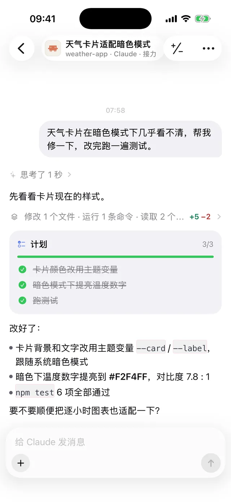
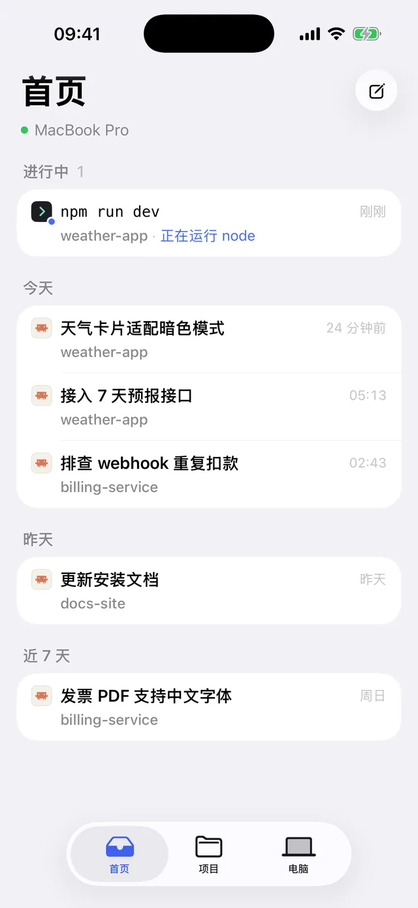
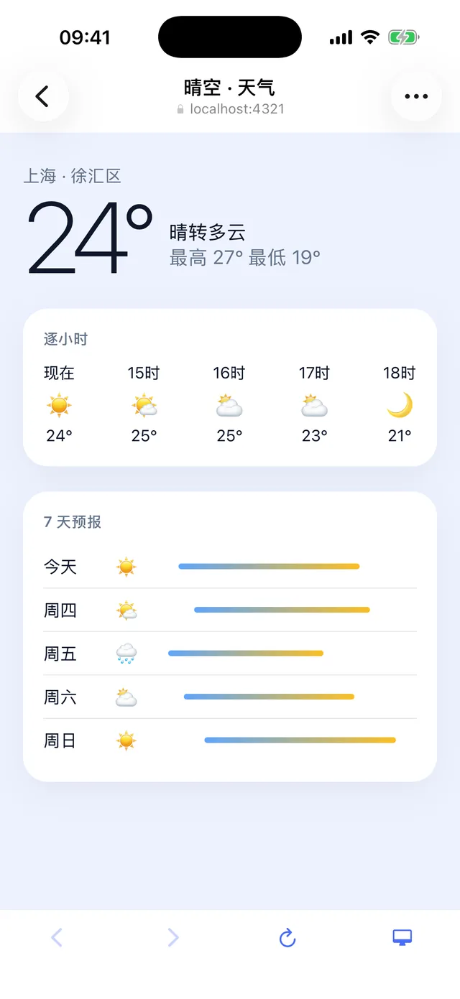

<p align="center">
  
</p>

<h1 align="center">LinkShell</h1>

<p align="center">
  <strong>Leave your desk. Your agents keep going.</strong><br />
  Follow, steer and approve the coding agents running on your computer — from your phone.
</p>

<p align="center">
  <a href="https://www.npmjs.com/package/linkshell-cli"></a>
  <a href="https://github.com/LiuTianjie/LinkShell/actions/workflows/test.yml"></a>
  <a href="LICENSE"></a>
</p>

<p align="center">
  <a href="https://liutianjie.github.io/LinkShell/">Website</a> ·
  <a href="https://liutianjie.github.io/LinkShell/docs/">Docs</a> ·
  <a href="https://apps.apple.com/cn/app/linkshell/id6761547516">iPhone</a> ·
  <a href="https://github.com/LiuTianjie/LinkShell/releases/latest">Android APK</a> ·
  <a href="README_CN.md">简体中文</a>
</p>

<p align="center">
  
  
  
</p>

Claude Code, Codex and other coding agents keep running on your computer. From your phone you watch them work live, send a message any time, approve what they ask for, and hand the session back to your terminal when you sit down again. Your code and the agent processes never leave your machine, and the connection is end-to-end encrypted.

## Get started

Your computer needs macOS or Linux and **Node.js 22.13 or newer**.

```bash
npm i -g linkshell-cli
linkshell host --daemon
```

Then connect your phone ([iPhone](https://apps.apple.com/cn/app/linkshell/id6761547516) · [Android](https://github.com/LiuTianjie/LinkShell/releases/latest)) one of two ways:

- **Pro — the official gateway.** Run `linkshell login`, then sign in to the app with the same account. Your computer shows up by itself; no QR codes.
- **Free — your own gateway.** Run a gateway ([below](#run-your-own-gateway)), point the host at it and pair once:

  ```bash
  linkshell host --gateway wss://gw.example.com --daemon
  linkshell pair    # scan the QR code in the app: Computers → Add computer
  ```

Start sessions from the phone, or launch agents from your terminal so you can hand them over any time:

```bash
linkshell claude    # Claude Code; send from the phone to take over, press any key here to take it back
linkshell codex     # Codex; the terminal and the phone are live at the same time
```

<details>
<summary>Other ways to install</summary>

```bash
brew install LiuTianjie/linkshell/linkshell
curl -fsSL https://liutianjie.github.io/LinkShell/install.sh | sh
```

</details>

## What you can do

- **Hand off between desk and phone.** Same session ID, full context. A model or effort chosen on the phone applies when the phone takes over.
- **Follow along live.** Replies stream word by word; plans, tool calls and file changes update as they happen, with a diff for every file.
- **Talk while it works.** A message sent mid-turn waits in a queue above the composer: reorder it, take it back to edit, or send it now — into the running turn for Codex and Claude, by stopping the turn for other agents. Stop works on a turn running on the computer too.
- **Sub-agents at hand.** The sub-agents a session started are one tap away from its header, each with its own conversation, however far back it began.
- **Approve from anywhere.** Permission requests arrive on the phone; allow or deny in one tap.
- **Change settings.** Model, reasoning effort, permission mode, fast mode — whatever the agent offers.
- **Keep sessions tidy.** Rename, archive and delete; for Codex and Claude this also updates their own records.
- **Use a real terminal.** Terminals on your computer with a Ctrl / Esc / Tab / arrow-key bar. They keep running when you close the app.
- **Open localhost on your phone.** Your dev server's port, over the same encrypted channel, with hot reload and a full-screen mode. No open ports, no shared Wi-Fi.
- **Fork and worktrees.** Fork a session from any reply to try another direction, in the same directory or in a new git worktree; start a session in a worktree so it doesn't touch what you're working on. Claude and Codex fork natively; for other agents LinkShell hands the conversation over as text.
- **Slash commands.** `/` lists what the agent offers — its commands and your skills. `/compact` and `/review` work for Codex from the phone too.
- **Long sessions stay light.** A session opens at its latest turns; pull down for earlier ones. Screenshots in it load when you look at them.
- **Screen and files.** Glance at the computer's screen (needs `ffmpeg`), browse and read the project's files, and send photos or files from the phone into the project.

## Agents

LinkShell runs the agents already installed and signed in on your computer. It never handles their accounts or API keys.

| Agent | Mode | What you get |
| --- | --- | --- |
| **Codex** | Shared | `linkshell codex` and the phone are live at once; either side can send, interrupt and approve |
| **Claude Code** | Handoff | Claude's own UI at your desk; a message from the phone takes over, any key on the computer takes it back |
| **Gemini CLI, GitHub Copilot, OpenCode, Cursor, Grok** | Remote | Start and continue sessions from the phone over the [Agent Client Protocol](https://agentclientprotocol.com): live output, approvals, modes and models |
| **Any CLI** | Terminal | A terminal on the computer, viewed and typed into from the phone |

A Claude session opened in the Claude desktop app can be followed live and continued from the phone too. The app can't be handed a session, though: it won't show what the phone did until it is restarted. For handing a session back and forth, start it with `linkshell claude`.

## Run your own gateway

A gateway only relays encrypted frames and brokers pairing, so it needs very little. Either:

```bash
# on a server, with the CLI
linkshell gateway --port 8787 --daemon

# or with Docker
docker run -d --name linkshell-gateway -p 8787:8787 \
  -v linkshell-gateway:/data nickname4th/linkshell-gateway
```

On the internet, put an HTTPS reverse proxy in front (Caddy, Nginx) and use `wss://your-domain`. For use at home only, the gateway can run on the same computer: `linkshell host --gateway ws://<LAN-IP>:8787`. More in the [deployment guide](docs/deploy.md).

## Security

- **End-to-end encryption.** Phone and computer encrypt everything between them; the official gateway and yours only see ciphertext.
- **Pairing grants access.** A paired phone can do what you can do in a terminal on that computer. Pair only devices you trust, and keep pairing codes to yourself.
- **Your agents, your accounts.** Agents run as your user, with your login shell's environment and their own sign-in. The Pro subscription only covers the gateway.
- **Local state.** Sessions and history are kept in `~/.linkshell` on the computer; pairings survive restarts.

## Commands

| Task | Command |
| --- | --- |
| Start LinkShell in the background | `linkshell host --daemon` |
| See agents, sessions and the gateway | `linkshell host status` |
| Stop it | `linkshell host stop` |
| Pair a phone (own gateway) | `linkshell pair` |
| See or remove paired phones | `linkshell devices` / `linkshell devices remove <name>` |
| Use the official gateway (Pro) | `linkshell login` / `linkshell logout` |
| Claude Code / Codex, shareable | `linkshell claude` / `linkshell codex` (arguments pass through) |
| Run a gateway | `linkshell gateway [--port 8787] [--daemon]` |
| Check the environment | `linkshell doctor` |
| Upgrade | `linkshell upgrade` |

> **Coming from 1.x?** 2.0 changes both the app and the computer side: upgrade both and pair again. The 1.x app still works with `linkshell start`.

## Development

A pnpm workspace; Node.js 22 (CI uses 22).

```bash
git clone https://github.com/LiuTianjie/LinkShell.git
cd LinkShell
pnpm install
pnpm build
pnpm test
```

| Directory | What it is |
| --- | --- |
| `packages/wire` | Session model, JSON-RPC methods, end-to-end encryption, relay client |
| `packages/host` | The host daemon: agent drivers (Codex app-server, Claude handoff, ACP), terminals, ports, screen |
| `packages/gateway-v2` | The relay: routes encrypted frames, brokers pairing |
| `packages/gateway` | The deployable gateway (official and self-hosted), including 1.x support |
| `packages/cli` | `linkshell`: host, pairing, agent launchers, gateway, login |
| `packages/client-core` | Client state and timeline shared by the apps |
| `apps/client` | The 2.0 app: Expo / React Native for iOS and Android |
| `apps/mobile`, `apps/web-dashboard`, `packages/shared-protocol` | 1.x app, web console and protocol |
| `docs/site` | Website and installer (`python3 scripts/build-site-pages.py` after editing) |

To work on the app, run a host with a local API next to Metro:

```bash
cd packages/cli && npx tsx src/index.ts host --dev-port 7878
pnpm --filter @linkshell/client start
```

Focused bug reports and pull requests are welcome. Include the CLI version, OS, agent and a minimal reproduction, and redact pairing codes and tokens. See the [release SOP](docs/release-sop.md) for publishing.

## Support the project

Sponsored by [AI18N](https://ai18n.chat/), an AI API gateway with OpenAI- and Anthropic-compatible interfaces.

<details>
<summary>Buy the author a coffee</summary>

<p>
  
  
</p>

</details>

[Product Hunt](https://www.producthunt.com/products/linkshell)

## License

[MIT](LICENSE).
