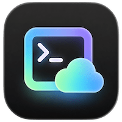

<p align="center">
  
</p>

<h1 align="center">LinkShell</h1>

<p align="center">
  <strong>Remote Terminal for Claude Code & Codex</strong>
</p>

<p align="center">
  在手机上远程查看和控制本地 Claude Code / Codex 终端会话
</p>

<p align="center">
  <a href="README.md">English</a>
  &nbsp;&nbsp;|&nbsp;&nbsp;
  <strong>中文</strong>
</p>

<p align="center">
  <a href="https://liutianjie.github.io/LinkShell/">🌐 官网</a>
  &nbsp;&nbsp;·&nbsp;&nbsp;
  <a href="https://github.com/LiuTianjie/LinkShell/releases/latest">📦 Releases</a>
  &nbsp;&nbsp;·&nbsp;&nbsp;
  <a href="docs/user-guide.md">📖 文档</a>
</p>

<p align="center">
  
  
  
</p>

<p align="center">
  <a href="https://www.producthunt.com/products/linkshell?embed=true&amp;utm_source=badge-featured&amp;utm_medium=badge&amp;utm_campaign=badge-linkshell" target="_blank" rel="noopener noreferrer"></a>
</p>

<p align="center">
  <video src="https://github.com/user-attachments/assets/cc09d3a7-239c-4d5c-a2a7-76f64d4af070" width="280" autoplay loop muted playsinline></video>
  &nbsp;&nbsp;
  <video src="https://github.com/user-attachments/assets/d24a1699-fb8e-4a27-a51d-27a290f7ec73" width="280" autoplay loop muted playsinline></video>
</p>

## 📲 下载 App

<table>
  <tr>
    <td align="center">
      <a href="https://apps.apple.com/cn/app/linkshell/id6761547516">
        
      </a>
      <br /><sub>iOS 14+</sub>
    </td>
    <td align="center">
      <a href="https://github.com/LiuTianjie/LinkShell/releases/latest">
        
      </a>
      <br /><sub>Android 8+</sub>
    </td>
  </tr>
</table>

> Android 版本可从 GitHub Releases 下载 APK，iOS 版本已上架 App Store。

## 一条命令开始

```bash
# npm
npm install -g linkshell-cli

# Homebrew (macOS)
brew install LiuTianjie/linkshell/linkshell

# 或 curl 安装
curl -fsSL https://liutianjie.github.io/LinkShell/install.sh | sh
```

```bash
linkshell start --daemon --provider claude
```

CLI 会在后台启动内置 Gateway + 终端桥接，打印配对码和 QR 码。手机扫码即连。App 断开不影响后台进程。macOS 上会默认阻止系统闲置睡眠，所以锁屏后一般不会掉线。

## 命令一览

```bash
linkshell start --daemon --provider claude   # 后台启动（内置 Gateway + 桥接）
linkshell start --daemon --provider claude --no-keep-awake  # macOS：允许闲置睡眠
linkshell start --provider claude             # 前台启动
linkshell start --daemon --provider codex --agent-ui  # 实验性 Agent GUI（ACP）
linkshell status                              # 查看运行状态
linkshell stop                                # 停止所有后台进程
tail -f ~/.linkshell/bridge.log               # 查看日志

linkshell gateway --daemon                    # 单独后台启动 Gateway（服务器部署用）
linkshell gateway status                      # 查看 Gateway 状态
linkshell gateway stop                        # 停止 Gateway

linkshell setup                               # 交互式配置
linkshell doctor                              # 环境检查
linkshell upgrade                             # 升级到最新版本
linkshell login                               # 登录（启用高级网关）
linkshell logout                              # 退出登录
```

## 架构

```
你的电脑                                         你的手机
┌──────────────────────┐   WebSocket   ┌──────────┐
│ CLI + 内置 Gateway    │ ◄───────────► │ App      │
│ (PTY + 消息中转)      │              │ (xterm)  │
└──────────────────────┘              └──────────┘
```

默认模式下 CLI 内置 Gateway，一条命令搞定。也可以把 Gateway 独立部署到公网服务器：

```
你的电脑                    公网服务器                    你的手机
┌──────────┐  WebSocket   ┌──────────┐   WebSocket   ┌──────────┐
│ CLI      │ ────────────►│ Gateway  │◄──────────── │ App      │
│ (PTY)    │              │ (中转)    │              │ (xterm)  │
└──────────┘              └──────────┘              └──────────┘
```

## 使用方式

### 最简模式（内置 Gateway，局域网）

```bash
linkshell start --daemon --provider claude
```

手机和电脑在同一 WiFi，CLI 自动检测局域网 IP 生成 QR 码。

### macOS 锁屏 / 睡眠

`linkshell start` 会在 bridge 运行期间默认开启 macOS 保活。内部使用 `caffeinate -i -w <bridge-pid>` 阻止系统闲置睡眠，但不会强制点亮屏幕，也不会解锁电脑。

```bash
linkshell start --daemon --provider claude
```

如果更在意电量，希望允许系统闲置睡眠：

```bash
linkshell start --daemon --provider claude --no-keep-awake
# 或
LINKSHELL_KEEP_AWAKE=0 linkshell start --daemon --provider claude
```

### 远程桌面查看

```bash
linkshell start --daemon --provider claude --screen
```

加 `--screen` 后，App 端可以切换到 Desktop 标签查看电脑桌面。支持 WebRTC（30fps）和截图流（fallback）两种模式，自动选择最优方案。

> **前置依赖：** 需要安装 [ffmpeg](https://ffmpeg.org/)。
>
> ```bash
> # macOS
> brew install ffmpeg
>
> # Ubuntu / Debian
> sudo apt install ffmpeg
>
> # Windows (Chocolatey)
> choco install ffmpeg
> ```
>
> 安装后 CLI 会自动检测屏幕设备并启动 H.264 编码流。如果同时安装了 [werift](https://github.com/nicktomlin/werift)（`npm i -g werift`），会优先使用 WebRTC 低延迟传输；否则回退到截图流模式。

### Agent GUI（实验性）

LinkShell 可以在 Terminal、Desktop、Browser 之外显示基于 ACP 的 Agent 标签，用结构化卡片展示对话、工具调用和权限请求。第一版优先面向 Codex 兼容 ACP agent，Terminal 仍然保留为 fallback。

```bash
linkshell start --daemon --provider codex --agent-ui
```

如果你的 agent 需要自定义 ACP 命令，可以显式传入：

```bash
linkshell start --daemon --provider codex --agent-ui --agent-command "codex app-server --listen stdio://"
linkshell start --daemon --provider claude --agent-ui --agent-provider claude --agent-command "<your-acp-adapter>"
```

如果本机 ACP agent 不可用，App 会显示 Agent 不可用提示，终端会话不受影响。

### 端口转发（预览 Dev Server）

在远程终端启动 dev server 后，可以直接在手机上预览页面：

1. 在终端中启动服务，如 `npm run dev`（监听 3000 端口）
2. 切换到 App 的 Browser 标签（globe 图标）
3. 输入端口号，点击 Go

支持：
- 静态资源、CSS、JS、图片等完整加载
- HMR / WebSocket 热更新（Vite、Next.js 等）
- PC / 手机视图切换
- 全屏预览模式

> 需要 `linkshell-cli >= 0.2.53`，`@linkshell/gateway >= 0.2.17`

### 远程模式（独立 Gateway，跨网络）

在服务器上：

```bash
npm install -g linkshell-cli
linkshell gateway --daemon --port 8787
```

在你的电脑上：

```bash
linkshell start --daemon --gateway wss://your-server.com:8787/ws --provider claude
```

也可以用 Docker 部署 Gateway：

```bash
# 从 Docker Hub 拉取（推荐）
docker pull nickname4th/linkshell-gateway:latest
docker run -d -p 8787:8787 --name linkshell-gateway nickname4th/linkshell-gateway:latest

# 或从源码构建
git clone https://github.com/LiuTianjie/LinkShell
cd LinkShell
docker compose up -d
```

详细部署文档见 [docs/deploy.md](docs/deploy.md)。

### 管理后台进程

```bash
linkshell status    # 查看 Bridge 和 Gateway 运行状态
linkshell stop      # 停止所有后台进程
```

### 手机连接

在 App 中：
- 扫描 CLI 打印的 QR 码（推荐）
- 或手动输入 Gateway 地址 + 6 位配对码
- 或从会话列表直接选择

App 断开后重新连接不影响后台进程，扫码或输入配对码即可恢复。

## 本地开发

```bash
pnpm install
pnpm dev:gateway    # 单独启动网关 (localhost:8787)
pnpm dev:web        # Web 调试端 (localhost:5173)
pnpm dev:app        # Expo App

# CLI 本地联调
pnpm --filter linkshell-cli dev start --provider custom --command bash
```

## 交接文档

1. [docs/ai-handoff.md](docs/ai-handoff.md) — 仓库级接手说明
2. [apps/mobile/README.md](apps/mobile/README.md) — 移动端信息架构

## 项目结构

```
├── packages/
│   ├── shared-protocol/       # 三端共享协议（Zod schema、消息类型、版本协商）
│   ├── cli/                   # CLI（PTY、内置 Gateway、daemon、doctor/setup/login/upgrade）
│   └── gateway/               # 云端网关（配对、会话、路由、控制权、认证、限流）
│       └── Dockerfile
├── apps/
│   ├── mobile/                # Expo App（WebView + xterm.js、多服务器管理、会话列表）
│   ├── web-dashboard/         # Web 管理面板（Vite + React + Tailwind、登录、订阅、设备管理）
│   └── web-debug/             # Web 调试端（Vite + xterm.js + 调试面板）
├── docs/
│   ├── site/                  # 宣传 Landing Page + 安装脚本
│   ├── brew/                  # Homebrew formula
│   ├── ai-handoff.md          # 接手说明
│   ├── deploy.md              # Gateway 部署文档
│   └── user-guide.md          # 终端用户文档
├── docker-compose.yml
├── .env.example
└── PRD.md
```

## 网关 API

| 方法 | 路径 | 说明 |
|------|------|------|
| `GET` | `/healthz` | 健康检查 |
| `POST` | `/pairings` | 创建配对（6 位 code，10 分钟有效） |
| `POST` | `/pairings/claim` | 用 code 换取 sessionId |
| `GET` | `/pairings/:code/status` | 查询配对状态 |
| `GET` | `/sessions` | 列出活跃会话 |
| `GET` | `/sessions/:id` | 会话详情 |
| `WS` | `/ws?sessionId=&role=` | 实时连接 |
| `GET/POST` | `/tunnel/:sessionId/:port/**` | HTTP 端口转发 |
| `WS` | `/tunnel/:sessionId/:port/**` | WebSocket 端口转发（HMR） |

## 可靠性

- ACK 确认 + 双层缓冲（CLI 1000 条 + 网关 200 条）
- 指数退避自动重连（CLI 和 App 双端）
- 心跳检测（15s/20s）
- 会话保持（host 断开保留 60s，空闲 30min 清理）
- 单设备控制权管理
- 协议版本协商
- CORS + 限流 + 优雅关闭
- Daemon 模式（CLI 和 Gateway 均支持后台运行）

## Sponsors

- [AI18N](https://ai18n.chat/) — Unified AI API Gateway，支持 Claude 模型的 OpenAI / Anthropic 兼容 API

## Buy Me a Coffee

如果 LinkShell 对你有帮助，可以请作者喝杯咖啡：

<p>
  
  
</p>

## License

MIT
