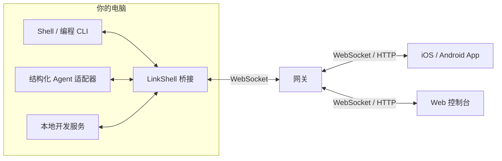

<p align="center">
  
</p>

<h1 align="center">LinkShell</h1>

<p align="center">
  <strong>离开电脑，继续工作。</strong><br />
  在手机或浏览器中，连接本机终端、编程 Agent 与开发预览。
</p>

<p align="center">
  <a href="https://www.npmjs.com/package/linkshell-cli"></a>
  <a href="https://github.com/LiuTianjie/LinkShell/actions/workflows/test.yml"></a>
  <a href="LICENSE"></a>
</p>

<p align="center">
  <a href="https://liutianjie.github.io/LinkShell/">官网</a> ·
  <a href="https://apps.apple.com/cn/app/linkshell/id6761547516">iOS App</a> ·
  <a href="https://github.com/LiuTianjie/LinkShell/releases/latest">Android APK</a> ·
  <a href="docs/deploy.md">自托管</a> ·
  <a href="README.md">English</a>
</p>

<p align="center">
  
  
  
</p>

LinkShell 让你继续操作自己电脑上正在进行的工作：接着使用终端、查看编程 Agent 的进展、响应受支持的审批请求，或在手机上打开本地开发服务。

CLI 在主机上启动终端桥接与内置网关，客户端配对后即可通过网络连接。跨网络访问时，可使用自托管网关或可选的托管服务。代码与 Agent 进程始终在主机上运行。

## 开始连接

先在主机安装 Node.js，以及准备使用的编程 CLI。然后进入项目目录：

```bash
npm install -g linkshell-cli
linkshell start --daemon
```

1. 在同一网络下打开 [iOS App](https://apps.apple.com/cn/app/linkshell/id6761547516) 或 [Android App](https://github.com/LiuTianjie/LinkShell/releases/latest)。
2. 扫描 CLI 输出的二维码，或输入网关地址与配对码。
3. 使用终端，或在 **Agent Workspace** 中选择可用的 Provider。

偏好浏览器？直接打开 CLI 显示的网关地址并配对。Web 控制台随 CLI 分发，由网关直接提供。

终端默认启动当前用户的 shell，可在其中运行已安装的 `claude`、`codex`、`gemini`、`copilot` 或其他命令。Agent Workspace 默认启用，并检测受支持的 Claude Code 与 Codex 安装。

> 从旧版指南升级？`--provider claude` 等命名终端 Provider 已弃用。请直接使用默认 shell，或通过 `--command <executable>` 启动指定程序。`--agent-provider` 则用于选择结构化 Agent Workspace 的 Provider，两者相互独立。

<details>
<summary>其他安装方式</summary>

macOS Homebrew：

```bash
brew install LiuTianjie/linkshell/linkshell
```

Shell 安装器：

```bash
curl -fsSL https://liutianjie.github.io/LinkShell/install.sh | sh
```

</details>

## 一次连接，四种视图

| 视图 | 可以完成的工作 |
| --- | --- |
| **Terminal** | 通过 xterm.js 操作主机上的真实 PTY，切换终端，运行已有 CLI 工具 |
| **Agent Workspace** | 阅读结构化对话、工具活动、计划与文件变更，响应 Provider 支持的补充输入和审批请求 |
| **Browser** | 通过 HTTP / WebSocket 转发预览主机开发服务，包括 HMR |
| **Desktop** | 启用共享后查看主机屏幕，优先使用 WebRTC，必要时回退到截图流 |

客户端断开和重连时，CLI 可以继续在后台运行。macOS 默认在桥接运行期间阻止**系统闲置睡眠**，不会强制保持屏幕点亮。主机仍需保持运行，并能够通过网络访问。

### Agent Workspace

受支持的 Provider 会向客户端报告可用能力，包括模型、推理强度、权限模式、图文输入、工具事件和会话历史。具体能力取决于当前 Provider 及其安装版本。

| Agent | 终端方式 | 结构化工作区 |
| --- | --- | --- |
| Claude Code | 在 shell 中运行 `claude` | Claude Agent SDK；可用时回退到 stream-json |
| Codex | 在 shell 中运行 `codex` | Codex app-server |
| Gemini CLI、GitHub Copilot CLI 等工具 | 在 shell 中运行对应命令 | 不承诺具备同等结构化适配 |

```bash
# 自动检测受支持的 Agent
linkshell start --daemon

# 明确选择 Codex 工作区
linkshell start --daemon --agent-provider codex

# 以前台方式启动终端桥接，关闭 Agent Workspace
linkshell start --no-agent-ui
```

其他被发现的本地 Agent 也可能出现在会话树中，但进程发现不会把它们的终端会话转换成结构化对话。没有受支持的 Provider 时，仍可使用终端。

Claude 的 stream-json 回退路径不提供交互式工具审批。需要逐项审批时，应使用 SDK 路径；界面可用的控制项以当前适配器报告的能力为准。

### 预览开发服务

在主机终端中启动开发服务，例如 `npm run dev`，然后在 App 的 **Browser** 视图输入端口号，如 `3000`。

LinkShell 同时转发 HTTP 资源和 WebSocket 流量，受支持的开发服务可以保留热更新。App 提供手机 / 桌面视口切换与全屏预览。详见[网关部署与代理配置](docs/deploy.md)。

### 查看电脑桌面

在主机安装 `ffmpeg`，然后启用屏幕共享：

```bash
linkshell start --daemon --screen
```

按系统要求授予屏幕录制权限。CLI 在可用时通过可选依赖 `werift` 使用 WebRTC，否则回退到截图流。Desktop 用于查看主机画面，终端和 Agent 交互通过各自的通道完成。

## 选择连接方式

| 模式 | 网关运行位置 | 账号要求 | 适用场景 |
| --- | --- | --- | --- |
| **局域网** | CLI 内置网关 | 无需托管账号，客户端分别配对 | 手机与电脑位于可以互访的同一网络 |
| **自托管** | 自己的服务器 | 默认无需托管账号 | 通过自己的中继跨网络访问 |
| **托管服务** | 官方网关 | 登录并具有 Pro 权益 | 使用托管中继和账号所属会话 |


```mermaid
flowchart LR
    subgraph Host[你的电脑]
        Shell[Shell / 编程 CLI] <--> Bridge[LinkShell 桥接]
        Agents[结构化 Agent 适配器] <--> Bridge
        Dev[本地开发服务] <--> Bridge
    end
    Bridge <-->|WebSocket| Gateway[网关]
    Gateway <-->|WebSocket / HTTP| Phone[iOS / Android App]
    Gateway <-->|WebSocket / HTTP| Browser[Web 控制台]
```

局域网模式下，网关和桥接运行在同一台电脑；远程模式下，主机与客户端分别连接到可访问的网关。网关同时同源提供 Web 控制台。

### 运行自己的网关

在服务器上：

```bash
npm install -g linkshell-cli
linkshell gateway --daemon --port 8787
```

为网关配置支持 WebSocket 的 HTTPS 反向代理，然后在运行项目的电脑上执行：

```bash
linkshell start --daemon --gateway wss://relay.example.com/ws
```

App 或浏览器连接 `https://relay.example.com` 并配对。Docker 部署、反向代理示例、防火墙要求与可选认证配置见[部署指南](docs/deploy.md)。

## 安全与会话行为

- **配对即授予访问权。** 客户端配对后使用与会话绑定的设备令牌；请保护配对码、二维码与已存储凭据。
- **网关属于受信任基础设施。** 跨网络部署应使用 HTTPS / WSS。当前不提供端到端加密，中继运营方处于信任边界内。
- **操作沿用主机权限。** 终端命令和 Agent 操作使用主机进程的访问权限执行，请只与可信客户端配对。
- **重连能力有边界。** ACK、输出缓冲重放、心跳和退避重连支持短暂断线，不保证恢复主机重启、会话过期或进程丢失前的状态。
- **模型服务独立配置。** 模型请求由已安装 Agent 的账号与 Provider 配置决定；可选的官方网关订阅是独立服务。

移动端在本地保存对话历史以便恢复。网关的会话与重放状态不等于终端或项目备份。协议和网关细节见 [shared-protocol](packages/shared-protocol/README.md) 与 [gateway](packages/gateway/README.md)。

## 常用命令

| 任务 | 命令 |
| --- | --- |
| 后台启动 | `linkshell start --daemon` |
| 前台启动 | `linkshell start` |
| 运行指定程序 | `linkshell start --command bash` |
| 允许 macOS 闲置睡眠 | `linkshell start --daemon --no-keep-awake` |
| 查看桥接与网关状态 | `linkshell status` |
| 停止后台进程 | `linkshell stop` |
| 检查运行环境 | `linkshell doctor` |
| 读取桥接日志 | `tail -f ~/.linkshell/bridge.log` |
| 交互式配置 | `linkshell setup` |
| 升级 CLI | `linkshell upgrade` |
| 登录托管服务 | `linkshell login` |

已有后台进程运行时，先停止，再使用新的参数启动。完整命令以已安装版本的 `linkshell --help` 和 `linkshell start --help` 为准。

## 开发

仓库使用 pnpm workspace，当前 CI 使用 Node.js 20，包管理器版本固定在 `package.json` 中。

```bash
git clone https://github.com/LiuTianjie/LinkShell.git
cd LinkShell
pnpm install
pnpm -r --filter './packages/*' build
pnpm test
```

按需在不同终端启动各部分：

```bash
pnpm dev:gateway
pnpm --filter @linkshell/web-dashboard dev
pnpm dev:app

# 本地 CLI 开发
pnpm --filter linkshell-cli dev start --command bash
```

| 目录 | 职责 |
| --- | --- |
| `packages/cli` | PTY、后台进程、Agent 适配器、屏幕共享与内置网关 |
| `packages/gateway` | 配对、会话转发、设备令牌、访问控制与 HTTP / WebSocket 隧道 |
| `packages/shared-protocol` | Zod Schema、消息信封与协议协商 |
| `apps/mobile` | Expo / React Native 应用，使用 xterm.js 显示终端 |
| `apps/web-dashboard` | React Web 控制台，打包后随网关提供 |
| `docs/site` | 官网与安装器 |

欢迎提交聚焦的 Bug 报告和 Pull Request。请提供 CLI / 网关版本、主机系统、客户端类型、连接模式与最小复现，并从日志中移除配对码、设备令牌和敏感终端内容。代码改动请运行 `pnpm typecheck` 及相关测试。

移动端开发见[应用指南](apps/mobile/README.md)，仓库结构和发布流程见[维护说明](docs/ai-handoff.md)与[发布 SOP](docs/release-sop.md)。[用户指南](docs/user-guide.md)还包含其他工作流；当前默认启动 shell 的行为以本 README 和 CLI 帮助为准。

## 支持项目

感谢 [AI18N](https://ai18n.chat/) 赞助：提供面向 Claude 模型的 OpenAI / Anthropic 兼容 API 网关。

<details>
<summary>请作者喝杯咖啡</summary>

如果 LinkShell 帮你更方便地继续工作，可以支持项目的持续开发：

<p>
  
  
</p>

</details>

[演示视频 1](https://github.com/user-attachments/assets/cc09d3a7-239c-4d5c-a2a7-76f64d4af070) · [演示视频 2](https://github.com/user-attachments/assets/d24a1699-fb8e-4a27-a51d-27a290f7ec73) · [Product Hunt](https://www.producthunt.com/products/linkshell)

## 许可证

[MIT](LICENSE)。
