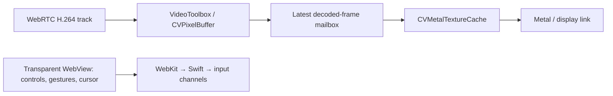

# Native iOS screen receiver

This local Expo module owns the WebRTC receiver, decoded-frame mailbox and Metal
presentation. It shares the installed JitsiWebRTC framework
with `react-native-webrtc`. The existing host forwarder carries authenticated
signalling; the media track remains DTLS-SRTP peer to peer.

The host's existing viewer page owns the floating toolbar, collapsible orb,
control-mode menu, connection/resolution popover, keyboard, shortcuts, text
composer and gestures. The same RN WebView is mounted transparently over the
native picture. A private WebKit message handler sends small input and picture
geometry messages directly to the native receiver, preserving the existing
ordered input and replaceable pointer channels. Frames never enter either JS
runtime. Hosts without this bridge fall back automatically to the regular viewer.

iOS starts with this receiver automatically and requests a **120 fps ceiling**.
The source display, receiver display, thermal state, Low Power Mode and transport
adaptation bound the actual frame rate. No playback-mode or frame-rate switch is
required. If the native receiver cannot start or loses its connection, the app
tries the standard WebRTC viewer, then the socket viewer through the encrypted
RPC/relay channel. The last step bypasses the direct data channel for this screen
only. A retry or a new screen visit starts with the native receiver again.
Android continues to use the standard viewer and its existing fallback.

This module ships in the normal LinkShell app (`com.bd.linkshell`) through the
regular TestFlight/App release workflow. There is no separate preview route or
acceptance app. A new native binary is required; a Metro reload cannot add it.
Diagnostics report sender and decoder output separately; neither is a physical
display-rate result.

## Architecture and compatibility

The [current end-to-end architecture](../../../../docs/v2/screen-realtime.md) distinguishes
this media peer (LinkShell.app ↔ receiver) from the independent bulk DataChannel
(Node host ↔ client). That bulk connection may carry the forwarded viewer HTTP/WebSocket;
its `direct` status does not prove media connectivity. The native receiver opens `/stream`
with `video=1` and its capability-limited `maxFps`. Host/Mac signalling remains necessary
throughout the session.

The module targets iOS 16.4+. It reuses `JitsiWebRTC ~>124.0.0` (the locally checked Pod lock
has 124.0.2), while the Mac uses M154. The native decoder factory offers H.264 only. FlexFEC
is offered by the Mac, but actual negotiation, received protection packets and recovered loss
must be validated separately; neither Mac loopback results nor WKWebView support establish
the native receiver's capabilities.



This module requires a native app build. With an older host missing the control bridge, or
with a failed/unsupported media path, the app moves through the normal fallback state machine.
The final RPC fallback only changes this screen's forwarding; unrelated direct streams remain
usable. RPC goes through the encrypted gateway tunnel for paired/account connections, or the
existing RPC connection for an explicitly configured development host.

## Pipeline

- The host accepts `maxFps=30|60|120` as a receiver ceiling, leaving adaptation
  enabled. Existing receivers remain at the existing 60/30 defaults. The Mac
  bounds its rate by the source display and uses 120/60/30 when both sides allow it.
- H.264 decodes through WebRTC's VideoToolbox decoder to `RTCCVPixelBuffer`.
  Frames never cross JS. Input crosses WebKit directly into the native data
  channels, bypassing React Native JS. No camera or microphone track is made.
- A single-slot decoded-frame mailbox replaces obsolete pending output. Encoded
  reference frames remain with WebRTC's dependency-aware receiver.
- Metal maps NV12 planes through `CVMetalTextureCache`; one pass renders the
  picture. The existing viewer draws its cursor. At most one GPU submission is in flight. A missed rendering
  deadline retains the newest candidate for the next display opportunity.
- iOS 17+ uses `CAMetalDisplayLink` with `preferredFrameLatency=1`; older supported
  iOS uses `CADisplayLink`. Display capabilities, Low Power Mode and thermal state
  bound the requested rate. No claim of physical scanout control is made.
- Closing the view or backgrounding tears down the socket, peer, track and display
  link. Reconnection starts a new session and releases held pointer state.

`maximumDrawableCount=2` bounds the drawable pool; the separate semaphore limits application
GPU submissions to one. Before taking the mailbox, presentation checks that the remaining
time exceeds `max(0.5 ms, estimated GPU work × 1.25)`. A missed opportunity leaves the newest
pending picture for the next one. Pool sizes and `preferredFrameLatency=1` are not measured
queue lengths or an end-to-end one-frame guarantee. There is no cross-device presentation-
deadline feedback yet.

The current integration sets the renderer's `showsPointer=false`: the WebView draws the
cursor, even though the Metal renderer also contains an optional cursor path. Gestures still
run in WebView JS and Mac input handling still reaches the main thread. The bridge is a
private message channel built with public WebKit APIs, not a private system API. Pixel-buffer
mapping avoids application-side CPU conversion/readback, but does not establish that every
capture, scaling, codec and network stage is zero-copy. The current source is 8-bit NV12,
BT.709/sRGB; HDR and 4:4:4 are not implemented.

## Measurement overhead

Diagnostics are **off by default**. This path uses the stock decoder directly:
there is no timing wrapper, per-frame presentation timing handler, background stats polling,
trace allocation, diagnostic JS event or diagnostic network traffic. The GPU
completion handler and deadline estimate are part of normal presentation control.

The existing **连接信息** popover requests only the normal WebRTC resolution,
decoded FPS and RTT counters while open; closing it stops these requests. It
does not reconnect the stream or enable decoder instrumentation. Resolution
choices stay in this popover instead of occupying a second permanent toolbar.

An internal native URL with **diagnostics=1** starts an instrumented session.
There is no permanent diagnostics panel in the product UI. It samples RTP timestamps
at approximately 1 in 31 frames, collects locally in bounded buffers, and reports
once every five seconds. Only sampled frames acquire measurement locks and record
decode/presentation timestamps. The displayed FPS is decoder output, not a claim
about distinct frames physically shown. Inter-sample gaps are never reported as
display jitter. Full tracing is a separate internal diagnostic mode, not enabled
by normal viewing or the connection-info popover.

Diagnostic percentiles are estimates and include their sample count. They measure
decoder and decode-to-presentation work, **not end-to-end capture-to-photon
latency**. Validation must compare instrumentation off/on using the same external
method and workload. Report the measured overhead and uncertainty; do not claim
zero observer effect. Never enable full tracing for a headline latency benchmark.

## Validation

```sh
swift test --package-path apps/client/modules/link-screen --scratch-path /tmp/linkshell-screen-tests
pnpm --filter @linkshell/mac test
pnpm --filter @linkshell/host test
pnpm typecheck
pnpm lint
pnpm build
```

The Swift package checks scheduling primitives without Expo, a screen or WebRTC.
The playback-state tests cover automatic fallback order and stale callbacks;
viewer tests exercise standard WebRTC failure and the relay request. The stream
integration test checks that a forced RPC stream coexists with direct streams.
On 2026-10-10, the receiver built for arm64 iPhone with Xcode 27.1 and passed
code-signature verification. Build evidence does not establish screen performance
or interaction correctness.

Known issue: the user reports a short periodic stutter roughly once per second
or faster in both native and web receivers. A native diagnostic snapshot showed
120 encoded / 116 decoded fps and decode-to-presentation p95 of 30.6 ms. The cause
has not been established or fixed; average throughput is not a frame-pacing pass.
Further diagnosis is deferred at the user's request.

Device checks use the regular release app:

1. Enter the screen and verify automatic native playback with the original
   floating controls. A 120 Hz source and receiver allow the highest ceiling;
   connection info reports actual decoded FPS, not the requested ceiling.
2. Check pointer/drag, scroll, keyboard, zoom, rotation, screen selection and
   reconnect/backgrounding. Run for 30 minutes to assess heat and sustained cadence.
3. Test networks where direct video is unavailable and confirm the automatic
   standard-video and relay fallbacks, with usable input after the transition.

Internal diagnostic sessions should settle before sampling; compare them with
normal playback separately. Input-to-result, actual display cadence,
and impaired/public-network behaviour still require device measurement. Stable
120 fps and stable 4K/60 were not demonstrated by the initial Mac loopback tests.
LTR feedback, content-adaptive tile transport and cross-device presentation-deadline
feedback remain later stages.
