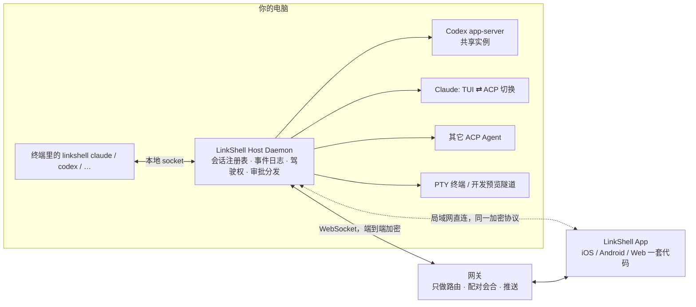

# LinkShell v2 架构设计

> 状态：草案（2026-09-29）· 决策：Expo 一套代码 / 协议直接断代 / 端到端加密

## 0. 为什么要重做

v1 是 Agent 进程的**旁观者**：电脑上跑的 `claude`、`codex` 由用户自己启动，LinkShell 只能靠 `ps` 和读 `~/.claude`、`~/.codex` 下的 jsonl 去猜状态。结果是：

- 电脑上正在运行的会话，手机端只能只读旁观，不能插话、不能打断（`agent-workspace.ts` 里直接拒绝）；
- 不实时：jsonl 按整条消息写盘，没有 token 流；Claude 的外部会话甚至没有实时跟踪；
- 标题、模型、权限靠猜字段，列表里全是文件夹名，工具栏显示「默认」；
- 手机新建的会话和电脑上的会话是两个世界，无法互相接手。

这些问题出在**归属模型**上，协议层面修补无法解决。v2 的核心变化是：**LinkShell 成为 Agent 进程的宿主**，电脑终端和手机都是同一个会话的客户端。

## 1. 目标与非目标

**目标**

1. 支持所有 AI coding agent，并诚实标注每个 Agent 能达到的体验档位（见 §3）。
2. 电脑 ⇄ 手机接力：实时逐字输出、随时插话、随时打断、远程审批。
3. 手机优先的信息架构：先看「需要我处理的」，一步新建任务。
4. 端到端加密：官方网关和自托管网关都只转发密文。
5. 配对一次永久有效，重启电脑不需要重新扫码。

**非目标（v2.0 不做，后续再议）**

- 桌面屏幕共享（WebRTC）——价值低、复杂度高，先不迁移。
- 用量统计面板。
- 旧协议兼容（直接断代）。

## 2. 总体架构



| 组件 | 职责 | v1 → v2 |
|---|---|---|
| **Host Daemon**（`packages/host`） | 常驻进程，持有所有 Agent 会话；SQLite 存会话与事件日志；驾驶权；审批广播；本地 socket 给终端 shim；对外加密通道 | 替代 `bridge-session.ts` + 6590 行的 `agent-workspace.ts` |
| **CLI**（`packages/cli`） | `linkshell start/pair/status/doctor`；`linkshell claude|codex|gemini|…` 作为终端入口；`linkshell run <cmd>` | 保留命令外壳，内部全换 |
| **Gateway**（`packages/gateway`） | 只路由密文帧；账号与机器/设备归属；配对会合；推送（APNs/FCM）；开发预览隧道；托管 Web 静态资源 | 去掉所有协议语义（不再缓存/解析 agent 消息） |
| **Client**（`apps/client`） | Expo + react-native-web，一套代码出 iOS / Android / Web | 替代 `apps/mobile` + `apps/web-dashboard` |
| **Wire**（`packages/wire`） | 会话模型、ACP 形状的会话事件、RPC 方法的 zod schema，外加与传输无关的 JSON-RPC 对端（客户端可复用） | 替代 `shared-protocol`（v1 的 60+ 种消息） |

## 3. Agent 驱动层：按档位支持所有 Agent

所有 Agent 实现同一个驱动接口，daemon 和客户端只面对统一的会话模型。能力差异通过 capabilities 声明，UI 按能力显示，不做假按钮。

| 档位 | 用户体验 | 实现 | 适用 |
|---|---|---|---|
| **1 多端同步** | 电脑 TUI 和手机同时在线，逐字同步，任何一端都能插话、打断、审批 | Agent 本身是「服务端 + 客户端」结构，daemon 作为又一个客户端挂上去 | Codex（已验证）、OpenCode |
| **2 接力** | 电脑前用 Agent 原生 TUI；手机接管时切到无头模式按**同一会话 id** 继续；电脑按任意键收回 | shim 持有 TUI 进程；daemon 用 ACP/SDK 驱动远程模式 | Claude（验证中）；其它 Agent 视 §3.4 验证结果 |
| **3 远程会话** | 完整结构化控制；电脑端用 LinkShell 自己的界面，不用 Agent 原生 TUI | 纯 ACP | ACP 注册表中其余 Agent |
| **4 终端** | 手机上看终端 + 输入 | daemon 持有 PTY | 任何 CLI |

### 3.1 Codex（档位 1，已验证）

daemon 启动并持有一个共享的 app-server：

```bash
codex app-server --listen unix://$HOME/.linkshell/run/codex.sock
```

- 终端入口 `linkshell codex [参数]` → `exec codex --remote unix://…/codex.sock [resume <threadId>]`，TUI 直接挂到共享实例。
- daemon 用 `thread/resume`（对运行中的 thread 是「重新加入」）订阅每个会话，把 `item/*`、`turn/*` 通知映射成统一事件。
- 审批：app-server 发来的 `item/*/requestApproval` 广播给所有端；任一端应答后 app-server 发 `serverRequest/resolved`，其它端收起卡片。
- `turn/start` 自带 `clientUserMessageId` 做幂等；另有 `turn/steer` 可在运行中插话。

**2026-09-29 实测**（codex-cli 0.154，脚本见 scratchpad）：

- 客户端 B 在 A 的回合进行到一半时加入，1.5 秒内实时收到 48 个 token 增量；
- B 打断 A 的回合，A 收到 `turn/completed: interrupted`；B 发起的新回合，A 能看到用户消息和逐字回复；
- 真实 TUI 通过 `--remote` 挂载：手机发的消息 TUI 实时显示，TUI 里输入的消息手机实时收到。

实现注意：

- unix socket 上跑的是 **WebSocket** 协议（不是裸 JSONL），客户端必须**关闭 permessage-deflate**，否则握手被重置；
- socket 路径受 104 字节上限约束，要放在短路径下；
- Codex 官方的 `codex app-server daemon` 依赖 standalone 安装，不依赖它，由我们自己拉起；
- 用户直接运行的普通 `codex`（不经 shim）是进程内 app-server，无法挂载。ps 检测到它在运行时，把该会话标为「外部运行中（只读）」；进程退出后可以正常 resume。

### 3.2 Claude（档位 2）

参照 Happy 的本地/远程模式切换：

```
电脑模式：shim 在用户终端里运行 `claude --session-id <id>`（或 --resume <id>）
          ├─ 手机侧可见性：跟踪 ~/.claude/projects/…/<id>.jsonl（消息级），另可看终端流
          └─ 手机点「接管」→ daemon 通知 shim
远程模式：shim 结束 TUI，终端显示「📱 手机正在操作 · 按任意键收回」并以文字形式同步进度
          ├─ daemon 用 @agentclientprotocol/claude-agent-acp 按同一 id 继续（逐字流、打断、审批）
          └─ 电脑上任意按键 → daemon 关闭 ACP 会话（session/close）→ shim 重新 `claude --resume <id>`
```

- 手机新建的 Claude 会话一开始就是远程模式；电脑上用 `linkshell claude --resume <id>`（或 `linkshell open <id>`）收回到本地。
- **单写者保证**：同一会话任一时刻只允许一个进程写入（TUI 或 ACP），切换由 daemon 串行化。实测两个适配器可以同时 resume 同一会话且**没有任何锁**，所以这条只能靠 daemon 保证。

**实现要点（M2）**：

- 适配器通过 `CLAUDE_CODE_EXECUTABLE` 使用用户自己的 `claude`，TUI 与远程回合读写同一种 transcript 格式。
- 历史与电脑模式都读 transcript（`~/.claude/projects/<编码后的 cwd>/<id>.jsonl`，轮询增量读取）；远程模式走 ACP 流。助手消息 id（`msg_…`）与工具 id（`toolu_…`）两边一致；用户消息 id 在 ACP 里是随机的，所以用户消息按「内容哈希 + 出现次数」识别，两边算法一致。
- 驾驶权三态：`desktop`（`linkshell claude` 的 TUI 在写）、`remote`（host 经 ACP 在写）、`none`（都没在写，两边都能继续）。「最后是谁写的」持久化；没有 shim 可以询问时，如果检测到直接运行的 `claude`（`ps -ww` 找到会话 id，或最近刚写过、来源不明），拒绝接管，并提示用 `linkshell claude --resume <id>` 打开。
- 手机发消息即接管；电脑在终端按任意键即收回（远程回合进行中会先取消）。

**2026-09-29 实测**（claude 2.1.227，`@agentclientprotocol/claude-agent-acp` 0.84.0）：

- `initialize` 声明了 `loadSession`，`sessionCapabilities` 包括 list / resume / close / fork / delete；`_meta.steering.supported = true`。
- CLI（`claude -p --session-id X`）建的会话，用 `session/resume` 和 `session/load` 都能接着跑，上下文连续；`session/load` 会先把历史回放成 `user_message_chunk` / `agent_message_chunk`。**两者都必须带 `cwd` 和 `mcpServers`（可以是 `[]`）**，否则参数校验失败。
- ACP 跑过的回合，`claude -p --resume X` 能看到；会话 id 始终不变。
- **模型和模式列表不在 `initialize` 里**，而是在 `session/new`、`session/resume`、`session/load` 响应的 `configOptions`（12 个模型）和 `modes.availableModes`（5 种权限模式）里。v1 工具栏显示「默认」就是因为只看了 initialize。
- `session/cancel` 是**通知**，不是请求；中途取消后 `stopReason = "cancelled"`。
- 审批请求：`session/request_permission`，选项为 `allow-once` / `allow-with-updates` / `reject`，kind 标准。
- `session/list` 列出 `~/.claude/projects` 下**所有项目**的会话，标题取首条用户消息。
- 适配器用的是 SDK 自带的 claude 二进制（2.1.284），不是用户装的 claude（2.1.227），存在版本差异，M2 要确认能否指定可执行文件路径。
- 交互式 TUI 与 ACP 的切换没有实测（只测了 `-p` 无头模式），M2 必须补测。
- **鉴权**：在剥掉环境变量的进程里，CLI 和适配器都返回 401。daemon 必须继承用户登录 shell 的完整环境（像 VS Code 那样解析 shell 环境），让 Agent 用的鉴权与用户在终端里完全一致。**绝不从其它进程读取凭据。**

### 3.3 其它 ACP Agent（档位 2 或 3）

- 通用 ACP 驱动，Agent 清单来自内置表 + ACP Registry（命令、检测方式、认证方式）。
- 若该 Agent 的 ACP 模式能恢复它自己 CLI 建的会话，而 CLI 也能恢复 ACP 会话，就复用 §3.2 的 shim 切换逻辑，升为档位 2；否则为档位 3。
- 各 Agent 特有能力通过 ACP `_meta` 透传，UI 按 capabilities 渲染。

### 3.4 实测矩阵

| Agent | 版本 | 驱动 | 档位 | CLI→远程 续接 | 远程→CLI 续接 | 打断 | 审批 | 备注 |
|---|---|---|---|---|---|---|---|---|
| Codex | 0.154.0 | app-server（共享） | **1** | ✅ | ✅ | ✅ | ✅（resolved 通知） | 已实测 |
| Claude | 2.1.227 | claude-agent-acp 0.84 | **2**（已实机验收） | ✅ 真实 transcript 导入，接管后答出暗号 | ✅ `claude --resume` 看到手机那一轮 | ✅（通知） | ✅ | 无写锁，daemon 保证单写者；模型列表在 session 响应里；逐 token 流式 |
| Gemini | 0.38.2 | `gemini --acp` | **3** | ❌ 无 list/resume；ACP 会话不落盘 | — | ⚠️ 取消通知被接受，但没有中途停下 | ✅ | CLI 在剥离环境下鉴权失败，续接未验证 |
| Copilot | 1.0.22 | `copilot --acp` | **2**（结构上） | ✅ CLI 会话出现在 `session/list`，`session/load` 成功 | ✅ `copilot --resume=<id>` 接受 ACP 会话 | 未验证 | 未验证 | 账号侧模型报错，内容连续性未验证 |
| Grok | 1.0.30 | `grok agent stdio` | 待定 | — | — | — | — | capabilities 最全（list/resume/close），但鉴权依赖 `~/.grok/leader.sock` 的 leader 进程，单独起 stdio 时 `Authentication required` |
| OpenCode | — | `opencode serve` / `opencode acp` | 1（预期） | | | | | 本机未安装；自带 HTTP 服务端 + attach，走档位 1 路线 |
| Cursor / Kimi / Qwen / Goose | — | ACP | 3（默认） | | | | | 本机未安装 |

**ACP 实现差异**（通用驱动必须兼容）：

- `initialize.protocolVersion` 要传整数 `1`（Gemini、Copilot 按整数校验）；
- `session/new`、`session/load`、`session/resume` 都要带 `mcpServers: []` 和 `cwd`；
- `session/cancel` 是通知；Agent 未必立即停下，UI 要显示「正在停止」直到回合真正结束；
- 审批是 Agent 发给客户端的**请求**，应答格式为 `{ outcome: { outcome: "selected", optionId } }`；
- 模型与模式列表在 `session/new` / `load` / `resume` 的响应里（`models`、`modes`、`configOptions` 三种写法都存在），不在 `initialize` 里；
- 各家都在 `_meta` 里有私有扩展（Claude 的 `steering`、Grok 的 `x.ai/*`），按能力选择性启用。
- 几乎所有 Agent 在剥离环境变量后都鉴权失败：**daemon 必须继承用户登录 shell 的环境**，这是通用前提，不是 Claude 独有的问题。

## 4. 协议 v2

### 4.1 分层

| 层 | 内容 | 网关能否看到 |
|---|---|---|
| L0 传输 | WebSocket（设备 ⇄ 网关 ⇄ 机器；或局域网直连） | 是 |
| L1 路由头 | `{ to, from, channel, frameId }`（machineId / deviceId） | 是 |
| L2 加密帧 | XChaCha20-Poly1305，密钥由配对时的 X25519 协商得出 | **否** |
| L3 RPC + 事件流 | JSON-RPC 2.0（与 ACP、Codex 同一种心智模型） | 否 |

### 4.2 RPC 方法（设备 → daemon）

```
machine.info                  已安装的 Agent 及档位、能力、在线状态
projects.list                 最近项目（按最后活跃排序）
fs.list / fs.search           选择目录（带搜索，不再从 ~ 逐层点）
sessions.list {cursor,filter} 会话摘要列表
sessions.create {agent, projectPath, prompt?, model?, mode?}
sessions.subscribe {sessionId, fromSeq}   → 推送 session.event
sessions.unsubscribe
sessions.prompt {sessionId, clientMessageId, content[]}   幂等
sessions.steer / sessions.cancel
sessions.permission.respond {sessionId, requestId, optionId}
sessions.takeover / sessions.release      驾驶权
sessions.setConfig {model?, mode?, effort?}
sessions.rename / archive / delete / fork
inbox.subscribe               跨会话的「需要你」动态（首页用）
terminals.* / tunnel.*        终端与开发预览
```

### 4.3 会话事件（daemon → 设备）

```ts
{ method: "session.event", params: { sessionId, seq, ts, event } }
```

- `seq` 是每个会话内单调递增的序号。客户端记住最后一个 seq，重连时 `subscribe(fromSeq)` 精确补差量；增量事件按 seq 去重，重放不会重复拼接。
- `event` **直接采用 ACP `SessionUpdate` 的形状**：`user_message_chunk`、`agent_message_chunk`、`agent_thought_chunk`、`tool_call`、`tool_call_update`、`plan`、`available_commands_update`、`current_mode_update`、`config_option_update`、`usage_update`。渲染器写一次，所有 Agent 通用。
- LinkShell 扩展（`ls_` 前缀）：
  - `ls_turn {state: started|ended, stopReason?}`
  - `ls_permission {requestId, toolCall, options}` / `ls_permission_resolved {requestId, optionId, by}`
  - `ls_driver {driver: desktop|remote, deviceId?}`
  - `ls_status {state: idle|running|waiting|error|offline}`
  - `ls_error {code, message, hint}`：给人看的错误，比如「Claude 凭据失效：在电脑上运行 claude /login」，不再直接甩原始 JSON
- 日志压缩：消息完成后合并为完整消息、丢弃其分片；`fromSeq` 早于压缩点时，先发快照再接后续事件。

### 4.4 会话摘要（列表用）

daemon 维护：`title`（Agent 提供，否则取首条用户消息）、`lastMessagePreview`、`status`、`updatedAt`、`agent`、`project`、`machine`、`driver`、`pendingPermissions`、每台设备各自的已读游标（用于「未读」）。

## 5. Agent 鉴权

LinkShell **从不经手 Agent 的凭据**，只用与用户终端完全相同的系统用户、环境和配置文件去运行 Agent。所以不论用户用哪种方式登录，都会自然生效：

| 方式 | 如何生效 |
|---|---|
| `claude /login`（claude.ai，存在钥匙串） | 同一系统用户运行，由 Agent 自己读取 |
| shell 配置里 export 的 API key / 第三方 `BASE_URL` + token | daemon 启动时解析登录 shell 环境（`resolveLoginShellEnv`） |
| `settings.json` 的 `env` / `apiKeyHelper`、Bedrock / Vertex | 由 Agent 自己读取配置 |
| 终端里临时 export 的变量 | shim（`linkshell claude`）把自己的环境交给 daemon，远程模式沿用 |

- **登录状态**用 Agent 自带的状态命令获取，只报告方式、不返回密钥：`claude auth status --json`（`loggedIn` / `authMethod` / `apiProvider`，如 `api_key`、`oauth_token`、`bedrock`）、`codex login status`（`Logged in using ChatGPT` / API key）。结果放进 `machine.info` 的 `agents[].auth`，在「电脑」页和 `linkshell doctor` 显示；未登录时给出具体操作提示。
- 已知限制：从非用户终端派生的进程（如另一个 App 的子进程）可能读不到钥匙串里的 claude.ai 登录。daemon 应由用户终端里的 `linkshell` 拉起，或由 launchd 以用户会话运行。

## 6. 身份、配对与加密

- **机器身份**：首次运行生成密钥对（`~/.linkshell/machine.key`，0600）。会话不再和「某次 CLI 进程」绑定。
- **配对**：`linkshell pair` 显示二维码，内容为 `{网关地址, machineId, 机器公钥, 一次性密钥}`。设备扫码后，经网关送回自己的公钥和证明；机器验证后保存设备公钥，双方协商出会话密钥。**配对一次永久有效**，可在任一端撤销。
- **账号（可选）**：登录后，机器和设备归属到用户；官方网关据此做路由授权和推送，但解不开内容。
- **局域网**：设备通过 mDNS 发现「附近的电脑」，直连 daemon，协议与加密完全相同。
- **Web 端**：密钥存 IndexedDB；网页通过手机上的二维码或机器二维码配对。
- **推送**：daemon 请网关推送「Codex 需要你审批 · 项目名」这类通用文案加 sessionId，不带代码内容；iOS 提供可操作通知（允许 / 拒绝）。

## 7. 信息架构与界面

**原则**：以「会话」为中心，不以主机或网关为中心；先展示需要我处理的；一步新建；只在 capabilities 支持时才显示对应按钮。

### 7.1 结构

```
底部三个标签
├─ 首页（收件箱）
│   ├─ 需要你：等待审批 / 提问（列表里可直接允许/拒绝）
│   ├─ 进行中：实时一行状态（“正在编辑 src/api.ts”）
│   └─ 最近：已完成，未读带点；可按机器 / Agent 筛选
├─ 项目
│   └─ 按机器分组的项目 → 项目下的会话；项目内一键新建
└─ 电脑
    ├─ 每台电脑：在线状态、已装 Agent 及档位徽标（多端同步 / 接力 / 远程 / 终端）
    ├─ 终端、开发预览端口
    └─ 配对 / 设置
全局「＋」新建：电脑（默认上次）→ 项目（最近优先，可搜索）→ Agent → 输入指令 → 开始（一屏完成）
```

### 7.2 会话页

- **标题栏**：Agent 图标 · 会话标题；副标题「项目 · 电脑」；驾驶权标签「💻 电脑正在操作 [接管]」或「📱 你在操作」。
- **时间线**：消息（Markdown）、思考（默认折叠）、工具调用（一行摘要，点开看详情）、内联 diff、计划清单。
- **审批卡**：固定在输入框上方，按钮大（允许 / 拒绝 / 总是允许）；推送通知里也能直接处理。
- **输入框**：文本、@文件、图片、语音；运行中发送 = 排队或插话（按能力），■ 停止。
- **顶部分段**：对话 | 改动 | 终端 | 预览。

### 7.3 电脑端（终端里的 shim）

- 启动时一行状态：「LinkShell · 已连接 2 台设备 · 手机可接管」。
- 远程模式：「📱 手机正在操作 · 按任意键收回」，并以文字形式同步远程进度。

## 8. 代码组织与迁移

同一仓库内重写，新旧并存到 v2 发布，发布后删除旧代码。

| 新 | 说明 | 复用 v1 |
|---|---|---|
| `packages/wire` | v2 schema（RPC、事件；加密帧在 M3） | — |
| `packages/host` | daemon、驱动、SQLite 存储、加密 | node-pty 终端管理、keep-awake、launchd 工具、隧道代理的 host 侧 |
| `packages/cli` | 命令外壳 + shim | commander 结构、doctor、登录 |
| `packages/gateway` | 密文路由、配对会合、推送、隧道、静态资源 | Supabase 鉴权、隧道、静态托管 |
| `apps/client` | Expo 一套代码 | xterm 终端 HTML 构建脚本、主题与图标资源 |

**发布后删除**：`packages/shared-protocol`、`apps/web-dashboard`、`apps/mobile`（被 `apps/client` 替代）、`packages/cli/src/runtime/acp/*`、v1 的会话/中继逻辑。

## 9. 里程碑（每一步都要本地可验证）

| 里程碑 | 内容 | 验证方式 |
|---|---|---|
| M0 ✅ | 前提实验：Codex 多端、Claude 接力、Gemini/Copilot/Grok 的 ACP 能力 | 实验脚本（结论见 §3） |
| M1 ✅ | daemon 骨架 + SQLite 事件日志 + 驱动接口 + **Codex 驱动** + `linkshell host` / `linkshell codex` | 34 个测试（含假 app-server 端到端）；`pnpm --filter @linkshell/host live:codex` 真实 Codex 8/8；真实 TUI 经 `linkshell codex` 双向实测 |
| M2 ✅ | **Claude 驱动**（TUI ⇄ ACP 切换、单写者、transcript 跟踪）+ 通用 ACP 驱动（Gemini / Copilot / Grok / OpenCode / Cursor，按需启动）+ `linkshell claude` 接力循环 + 登录状态 + 定期重新发现 | 53 个 host 测试（含假 claude TUI / 假 ACP Agent 的接力端到端）；`linkshell claude` 在伪终端实测接管与收回；真实 Agent 冒烟（发现 200 个会话，174 个带真实标题）；真实 Claude 实机验收 13/13（`pnpm --filter @linkshell/host live:claude`，须在用户自己的终端运行） |
| M3 | 加密通道 + 网关 v2（路由 / 配对 / 推送）+ 局域网直连 | 端到端测试：网关日志中只有密文；重启后无需重新配对 |
| M4 | Expo 客户端：首页 / 会话 / 新建 / 电脑 | Web 构建在浏览器里跑通，iOS 模拟器跑通 |
| M5 | 终端、开发预览、推送、语音输入迁移；发布 | 真机验收 |
| M6 | 删除 v1 代码 | typecheck + 测试 |

## 10. 风险

- **Codex app-server 标注为 experimental**：锁定支持的版本范围，加协议契约测试；启动时检测版本，不兼容则降级为档位 3（codex-acp）。
- **Claude 切换延迟**：收回时 TUI 重启需要几秒；远程模式期间电脑终端要有清晰的状态提示。
- **单写者**：切换期间有两个进程同时写同一会话的风险，由 daemon 的驾驶权租约保证。
- **ACP Agent 能力参差**：UI 完全由 capabilities 驱动。
- **重写范围大**：按里程碑推进，每一步独立可验证；v2 发布前 v1 继续可用。

## 参考

- [Agent Client Protocol](https://agentclientprotocol.com)：session/resume、session/close 已定稿，session/list 在 v2 中为必选
- [Happy](https://github.com/slopus/happy)（MIT）：本地/远程切换、消息 seq 与 localId、端到端加密、推送
- [OpenCode server](https://www.mintlify.com/anomalyco/opencode/server)：服务端 + TUI attach 的多客户端结构
- [Claude Code Remote Control](https://code.claude.com/docs/en/remote-control.md)：官方的 Claude 远程方案（只走 Anthropic 中继）
- Codex app-server：`codex app-server generate-ts` 可生成完整协议类型
