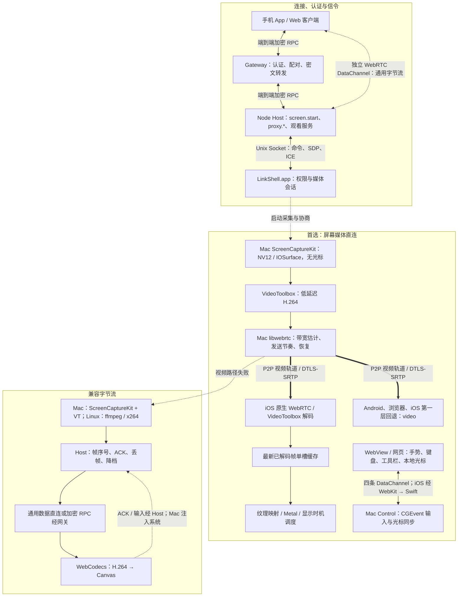

# 远程桌面技术架构：Mac → iOS、WebRTC 与兼容回退

> 现状核对：2026-10-10，按当前源码梳理。本文描述已实现的路径、配置和边界；不代表所有已安装版本均具备相同能力，也不把构建通过当作性能验收。
>
> 主路线：**ScreenCaptureKit → VideoToolbox 低延迟 H.264 → WebRTC 视频直连 → iOS 原生解码 → Metal 显示**。iOS 的透明 WebView 保留工具栏、手势和光标；失败依次回退网页 WebRTC 和强制 RPC 字节流。历史设计、回环数据与早期真机记录见 [历史存档](screen-realtime-history.md)。

## 1. 组件与完整链路

远程桌面有两条独立的 WebRTC 连接，不能把通用流的 `direct` 状态等同于视频轨道已经直连：

| 连接 | 两端 | 承载内容 | 协商入口 |
|---|---|---|---|
| 通用数据连接 | Node Host（werift）↔ 客户端 | 端口预览、观看页 HTTP/WebSocket、兼容 H.264 字节流 | RPC `direct.offer`，客户端发 offer |
| 屏幕媒体连接 | LinkShell.app（libwebrtc）↔ iOS 原生接收器或网页播放器 | 视频轨道，以及 `input` / `pointer` / `cursor` / `shape` 数据通道 | 观看服务 `/stream` 转发 SDP / ICE，Mac 发 offer |

Mac 视频直连成功后，画面不经过 Node Host 或 Gateway。直连使用 ICE/STUN，没有部署 TURN；失败后的网关转发仍然存在，是现有加密 RPC 上的兼容字节流。

本功能与 [Computer Use 窗口预览](computer-use.md) 不同：后者用独立 helper 捕获目标窗口、传输可独立解码的图片，不提供这里的整屏视频轨道和人工控制。

## 2. 从打开屏幕到开始播放

1. 客户端通过已配对设备或同账号身份连接 Host。Gateway 认证双方，Host 再检查设备授权。
2. `screen.start` 枚举显示器，返回 `{port, token, displays}`。Host 只在 `127.0.0.1` 上提供观看 HTML 和 `/stream` WebSocket；每次 start 生成新的随机 token，旧 URL 不再通过授权。
3. 手机用 `forwardPort` 在自己的回环地址提供入口，经 `HostStreams` 转到 Host。新流可走通用 DataChannel 或 RPC。Web 客户端通过 `proxy.*` 读取同一页面，装入隔离 iframe，用限于该端口的 WebSocket 桥接转发。
4. 原生 iOS 接收器或网页播放器请求 `/stream?video=1`。Host 通过 Unix Socket 向 Mac 发送 `rtc.open`；Mac 发 offer，接收端发 answer，双方交换 ICE 候选。
5. 媒体连接建立后，视频走加密轨道；输入与光标走该连接旁的四条 DataChannel。观看服务 socket 继续负责信令、控制授权状态和生命周期。
6. 关闭观看、切换显示器或断线时释放对应连接与输入状态。原生 iOS 退到后台会拆除媒体连接和显示调度，回到前台重新建立。屏幕由后来的观看者接手，不支持多人同时观看同一服务会话。

信令仍然依赖 Host 连接；已经打通视频并不意味着可以永久脱离 Host/Gateway 的会话管理。

## 3. Mac 发送端

### 3.1 采集与像素缓冲

`ScreenCapturer.swift` 使用 ScreenCaptureKit，输出 IOSurface 支撑的 `CVPixelBuffer`，格式为 8 位 NV12（Y + UV）、BT.709 视频范围，色彩空间为 sRGB。完整源帧和时间戳交给 libwebrtc；采集运行在独立的 `userInteractive` 队列。

- 视频路径 `showsCursor=false`，指针单独传输；兼容路径的 `StreamCapture` 则把指针采进画面。
- 更新帧率不重启采集。采集请求给目标帧率留 1.1 倍余量，后续管线限制实际输出。
- 静止画面停止产生新帧时，短期每 0.1 秒、随后每 0.5 秒重送最后画面，给关键帧和画质恢复留机会；这些重复帧不是新源内容。
- `captureQueueDepth=5` 是采集可用表面的配置，不能直接解释成固定排队五帧。

原生缓冲贯通减少应用层全帧 CPU 拷贝和格式转换，但缩放、裁剪、编码、封包仍可能涉及复制；没有全链路 trace 不能宣称绝对零拷贝。

### 3.2 默认低延迟 H.264 编码

`Engine.ownEncoder=true`：默认使用 `LowLatencyH264Encoder` 适配自有 `VideoCompressor`，底层仍是 Apple VideoToolbox 硬件编码。当前不是以 stock 编码器为默认。

| 设置或机制 | 当前作用 |
|---|---|
| `EnableLowLatencyRateControl` | 请求硬件低延迟码率控制 |
| `RealTime=true` | 实时编码 |
| `AllowFrameReordering=false` | 禁止帧重排 |
| WebRTC `setBitrate` → VT 属性更新 | 编码码率随传输反馈调整 |
| 请求关键帧 | 由 WebRTC 恢复请求驱动，不依赖固定帧数间隔 |
| Annex B / RTP 时间戳 / 采集时间 / QP | 适配器把编码结果连同元信息交回 libwebrtc |

初始化、运行错误或需要裁剪等不适合自有编码器的输入，会切换到 `H264ScreenEncoder`，以关键帧接续。`--encoder stock` 保留对照；上游编码器的 H.264 level 会按实际画面和会话帧率上限修正。

`MaxFrameDelayCount=0` 只是尝试设置；历史硬件检查不支持该属性的设置/读取，不能据此声称编码零排队。当前 iOS 原生解码工厂只支持 H.264；HEVC、AV1、HDR、4:4:4 不是现行主链路能力。

### 3.3 网络、恢复与播放等待

Mac 使用未修改上游的 stasel/WebRTC M154 预编译框架。libwebrtc 负责媒体带宽估计、发包节奏、反馈、NACK/RTX 和关键帧恢复。视频经 DTLS-SRTP 加密；数据通道使用 WebRTC 自身的加密传输。

- 默认启用 `WebRTC-ForceSendPlayoutDelay=min_ms:0,max_ms:0`，提示接收端尽快呈现；提示不消除组包、参考帧依赖、解码和系统呈现时间。
- 默认启用 FlexFEC 广告与发送能力。只有 answer 接受对应 codec 且 offer 有 FEC-FR 保护组，才记为 `negotiated`；未接受时继续 H.264 与 NACK/RTX。
- 协商成功、收到保护包、实际恢复丢包、减少冻结是四层不同的证据。现有回环只证明前两层，不能代替手机弱网验收。
- ICE 持续收集候选，但 Wi-Fi/蜂窝切换能否恢复仍需设备测试。当前没有 TURN。

## 4. iOS 原生接收与显示

`apps/client/modules/link-screen` 复用 `react-native-webrtc` 已安装的 JitsiWebRTC：pod 要求 `~>124.0.0`，本次核对的本地 Pod 锁定为 124.0.2。Mac M154、iOS M124 和 WKWebView 不能互相推定扩展能力。

### 4.1 解码、最新帧与 Metal

1. `ScreenConnection` 通过本机转发器上的 WebSocket 收发信令，原生 PeerConnection 接收视频轨道。
2. WebRTC 的 VideoToolbox H.264 解码器输出 `RTCCVPixelBuffer`；正常播放不加逐帧诊断包装。
3. `ScreenMailbox` 只保留最新的待呈现已解码帧。新帧替换尚未使用的旧帧，压住这一段的画面年龄；压缩参考帧仍由 WebRTC 管理，不能任意丢弃。
4. `CVMetalTextureCache` 将 NV12 的 Y / UV 平面映射为 `R8` / `RG8` 纹理，一次 Metal 绘制完成 YUV 转换、缩放和画面呈现。代码同时兼容解码器给出的 BGRA 缓冲。
5. 纹理和画面保持存活直到 GPU 完成读取。帧不进入 WebView JS 或 React Native JS，也不先转换成 UIImage。

### 4.2 按显示时机提交

- iOS 17+：`CAMetalDisplayLink`，`preferredFrameLatency=1`，使用目标呈现时间。
- 更早的受支持 iOS：`CADisplayLink` 的 `targetTimestamp`；模块最低 iOS 16.4。
- `maximumDrawableCount=2`；应用同时最多提交一笔 GPU 工作。
- 提交前比较剩余时间与估计 GPU 耗时，至少留 `max(0.5 ms, GPU耗时 × 1.25)`；错过预算或 GPU 忙时暂缓，保留最新候选供下次显示机会使用。

这些是本地显示调度与队列约束，不是物理扫描线控制，也不是“端到端只有一帧”的保证。发送端目前还没有使用 iOS 显示期限反馈来协同调度整条链路。

### 4.3 控制层仍是原来的 WebView

透明 RN WebView 覆盖在原生画面上，继续拥有悬浮工具栏、收起圆球、模式菜单、连接信息/清晰度弹层、键盘、快捷操作、文字框、手势和光标。画面布局通过 WebKit 消息交给 Metal，保留缩放和旋转的同一坐标系。

输入由网页识别，经公开的 `WKScriptMessageHandler` 直接送入 Swift，再发送到媒体 DataChannel；指针消息绕过 RN JS。当前集成设置 `showsPointer=false`，光标由网页绘制，不能把 Metal 中存在的可选光标代码描述成已经启用的产品路径。原生接收失败后复用同一套页面控件，不另做模式选择器。

## 5. 分辨率、帧率与适配

| 项目 | 当前值与边界 |
|---|---|
| 视频宽度 | 默认 1920；UI 可选 1280 / 1920 / 2560 / 原生；原生最多宽 3840，且不超过源显示器 |
| 原生 iOS 请求 | 默认最高 120 fps；显示能力、低电量模式、严重/临界温控把请求限制到 60 |
| Mac 自动帧率 | 按接收上限与源显示器能力选档；最高可 120，向 60 / 30 调整；源能力更低时进一步受限 |
| 旧接收端 | 未传 `maxFps` 时保留最高 60、降至 30 的路径 |
| `maxFps` | 接收能力上限，30 / 60 / 120；仍允许自动适配 |
| 显式 `fps` | 内部固定帧率请求，1–120；覆盖自动帧率选择，不能作为产品保证 |
| 码率 | 初始带宽估计 2 Mbps；上限按像素与帧率计算，限制在 2–30 Mbps；不是恒定发送速率 |

例如 1920×1080 的视频上限在 30 / 60 / 120 fps 下分别为 8 / 12 / 24 Mbps。高于 1080p 的像素增长按平方根缩放；实际码率由网络和内容决定。

`maintainFramerate` 允许 WebRTC 在资源不足时缩小画面。同时，编码器不提供 QP 缩放阈值，避免仅因桌面压缩程度就缩小分辨率；自有 `FrameRate` 每秒判断是否需要降帧，照顾文字清晰度。

持续 3 秒出现带宽估计低于按当前档位缩放的阈值、发送像素不足源画面的 90%，或活跃采集下编码吞吐不足，就尝试降档。恢复需要画面完整、无受限且有带宽余量持续 10 秒；恢复后很快又降档时，下一次等待翻倍，上限 160 秒。启动和每次切档后有 4 秒观察期。丢包率本身和单帧编码耗时不是单独的降帧条件。

## 6. 输入与光标

| 通道 | 方向 | 传输语义 |
|---|---|---|
| `input` | 接收端 → Mac | 可靠、有序；按下、松开、文字、快捷键和有顺序依赖的事件 |
| `pointer` | 接收端 → Mac | 无序、零重传；可替代的移动和部分滚动 |
| `cursor` | Mac → 接收端 | 无序、零重传；位置与事件序号 |
| `shape` | Mac → 接收端 | 可靠、有序；光标图片、热点、缩放和缓存 ID |

拖拽、按钮按住时的移动、与具体位置绑定的滚动等走可靠通道。Mac 的 `Control` 把显示器归一化坐标映射为系统坐标，用 CGEvent 注入鼠标与键盘。视频会话结束会释放持有的按钮和修饰键。

本地光标可即时响应，远程窗口和文字变化仍需真实输入处理及返回视频。当前手势在 WebView、Mac 输入处理在主线程；没有实现完全独立于 UI 线程的输入系统。辅助功能未授权时只能观看。

## 7. 回退与平台支持

| 接收端 | 起始路径 | 后续回退 |
|---|---|---|
| iOS，原生模块可用 | 原生 WebRTC → Metal | WKWebView WebRTC → 强制 RPC 字节流 → WebCodecs / Canvas |
| iOS，原生模块不可用 | WKWebView WebRTC | 强制 RPC 字节流 → WebCodecs / Canvas |
| Android | WebView WebRTC | 原通用转发路径上的 WebCodecs / Canvas |
| Web | 隔离 iframe 内 WebRTC | 原通用转发路径上的 WebCodecs / Canvas |

iOS 最后一步用 `direct:false` 重新建立该屏幕转发并关闭视频轨道请求，不再依赖通用 DataChannel；其他流不受影响。经网关连接时这一步走加密中继，开发直连 Host 时则走其 RPC 连接。重试、重新进入屏幕或更换 Host 连接会重新选择起始路径；旧代次失败回调不会跳过下一条路径。原生首次无画面超时为 12 秒，持续断开超过 4 秒会失败。

WebCodecs 不可用时会提示升级系统，不能承诺所有浏览器均可完成兼容回退。

| 主机 | 采集与编码 | 控制 |
|---|---|---|
| Apple silicon / Intel Mac，macOS 13+ | 主路径与回退均由 LinkShell.app 完成，无需 ffmpeg | 录屏权限 + 辅助功能权限 |
| Linux | ffmpeg `x11grab` + libx264，仅兼容路径，需要 X11/DISPLAY | 只看，无输入控制 |
| Windows | 当前屏幕功能不支持 | 不支持 |

Mac 安装包采用 Universal Binary：主程序与 WebRTC 同时包含 `arm64` 和 `x86_64`，npm 接受 `arm64` / `x64`，macOS 自动选择本机架构。Intel 与 Apple silicon 使用相同的视频直连及中转回退路径；低延迟编码不可用时回退标准 H.264 编码器，不因此强制中转。Intel 的采集、硬件编码、输入控制与端到端性能仍需真机验收；x86_64 编译和 Rosetta 测试不替代这一步。

Mac 兼容路径使用 `StreamCapture` / `StreamSession`，光标在画面里，编码帧经第二条 Unix Socket 送到 Host；Linux 用 ffmpeg。Host 再加关键帧标记和序号，客户端解码到 Canvas 后回 ACK；解码跳过的帧也会确认已消费，避免 Host 永久等它。拥堵时在发送前丢弃后续帧，恢复从关键帧开始，持续问题触发降档。

| 档位 | 最大宽度 | fps | 目标码率 | 码率 ceiling |
|---|---:|---:|---:|---:|
| 0 | 1600 | 20 | 3 Mbps | 4 Mbps |
| 1 | 1440 | 15 | 1.5 Mbps | 2 Mbps |
| 2 | 1280 | 12 | 900 Kbps | 1.3 Mbps |
| 3 | 1024 | 10 | 500 Kbps | 700 Kbps |
| 4 | 854 | 8 | 260 Kbps | 380 Kbps |

`q=low` 从档位 2 开始且不升到更高档；900 Kbps 是编码目标，不是含封装/加密/重传的网关线速硬上限。手机按网关路径附加该参数，当前 Web 入口未附加，不能把所有浏览器中继都说成固定从 12 fps 开始。视频宽度选择不改变这套兼容档位。

## 8. 安全、部署与配置

- Gateway 挑战由 Ed25519 签名；设备经配对或同账号授权。Host 校验已配对设备的键，或接受登录状态下网关确认的同账号设备。
- 客户端与 Host 通过 X25519 派生会话密钥，以 XChaCha20-Poly1305 加密 RPC 和中继流；Gateway 只见密文。SDP/DTLS 指纹通过已认证的信令路径传递。
- Host 观看端口只监听回环地址并校验 token。它不直接对公网开放。
- Mac 录屏与辅助功能权限绑定 `com.bd.linkshell.host` 和 Developer ID 签名身份；身份、bundle id 和安装路径须稳定。
- iOS 原生模块需包含在新的 App 二进制中，Metro 重载不能添加它；随正常 App / TestFlight 流程交付，没有独立预览应用。

| 配置 | 精确作用 |
|---|---|
| `LINKSHELL_ICE_SERVERS` | Host 的 STUN URL 列表，也传给 Mac 屏幕媒体会话 |
| `LINKSHELL_ICE_SERVERS=off` | 禁用通用 DataChannel 能力并让屏幕会话收到空 STUN 列表；不阻止视频会话尝试局域网候选 |
| `LINKSHELL_SCREEN_VIDEO=off` | Host 不提供屏幕视频轨道；用于兼容路径对照/排障 |
| `LINKSHELL_SCREEN_FPS=1..120` | Host 给 Mac 视频会话传固定 `fps`；内部对照用途 |
| `LINKSHELL_SCREEN_CLOCK=1` | 开启时间码测量入口；不要用诊断运行冒充普通播放性能 |

## 9. 性能证据与验收

已实现的性能手段包括原生像素缓冲、低延迟硬件 H.264、WebRTC 传输闭环、最新已解码帧缓存、Metal 映射与按显示时机提交。它们减少转换或等待，不自动证明端到端领先，也不等于零拷贝、零缓冲或物理扫描控制。

### 已有记录的边界

- 历史 WKWebView Wi-Fi、模拟器和 Mac 回环数据保存在 [历史存档](screen-realtime-history.md)，不是当前原生路径的性能结果，也不能外推到公网。
- 2026-10-10 的原生构建、签名与安装启动检查属于交付验证；没有证明完整手势正确性、持续帧率和公网性能。
- 已记录原生与网页/兼容路径约每秒或更短间隔出现短暂停顿，尚未定位或修复。一次原生诊断快照为 120 编码 fps、116 解码 fps、解码到呈现 p95 30.6 ms；这些平均吞吐和局部耗时不能证明显示节奏稳定。
- 稳定 120 fps、稳定 4K/60、手机端 FlexFEC 恢复收益仍未通过验证。历史 Mac 回环保护包计数不能替代手机丢包恢复证据。

### 测量口径

分别记录采集新帧率、重复帧、编码/解码吞吐、真实新画面的显示间隔、冻结/恢复、画面年龄 p50/p95/p99、输入到真实结果、分辨率、码率和热状态。不能用降低画质或大量跳帧掩盖另一维度的退化。

原生诊断默认关闭；连接信息弹层只在打开时请求普通 WebRTC 统计。内部 `diagnostics=1` 约每 31 帧抽样、每 5 秒汇总；解码与解码到呈现耗时不是采集到出光的端到端延迟。正常模式与诊断模式需用相同外部方法分别测量开销。

时间码 `measure=sync` 用最小 RTT 估计时钟偏移，信令与媒体可能走不同路径；公网非对称会影响结果。报告需给样本数、校时 RTT、误差和配置。软件呈现时间也不能替代高速摄影同拍两端的出光测量。

### 更改屏幕代码后的检查

按 [原生接收模块](../../apps/client/modules/link-screen/README.md#validation) 和 [发布 SOP](../release-sop.md) 执行构建/静态检查与相关测试，再用正常 App 真机验证：输入、拖拽、滚动、文字、缩放、旋转、切屏、前后台与重连，分别覆盖原生、网页视频和 RPC 回退。用相同源内容比较 60/120 档，至少 30 分钟检查热稳定性；另测公网、丢包、带宽骤降与网络切换。文档更新本身不产生新的性能证据。

## 10. 尚未实现的优化

以下属于后续研究，不能画进“当前已实现”的主路径：

- LTR 长期参考帧确认与恢复闭环：需绑定会话代次、帧标识与真实解码参考状态，处理过期反馈；仅开 VT 开关不够。
- ScreenCaptureKit dirty rects 与局部块更新：需统一版本、依赖、补齐和拥塞预算，防止漏更新与撕裂。
- iOS 显示期限反馈到 Mac：需跨端时间映射、误差界与过期回退；当前仅有 iOS 本地呈现预算。
- HEVC/AV1、HDR/4:4:4、slice 级流水线、输入线程进一步隔离：均需单独验证公开 API、兼容性与完整链路收益。
- UPnP/PCP/NAT-PMP 与 TURN：当前均未接入；先测直连覆盖率，再决定是否改变网络路线。

音频、自动双向剪贴板同步、桌面文件拖放和多人观看未实现。已有“发送文字”可读取手机剪贴板供用户确认后发送，这不等于剪贴板同步；会话文件上传是另一个功能。

## 11. 源码与技术参考

| 范围 | 入口 |
|---|---|
| Host 观看服务、信令、回退 | [screen.ts](../../packages/host/src/screen.ts)、[input.ts](../../packages/host/src/input.ts)、[screen-pacer.ts](../../packages/host/src/screen-pacer.ts) |
| 通用数据直连与转发 | [direct.ts](../../packages/host/src/direct.ts)、[streams.ts](../../packages/client-core/src/streams.ts)、[preview.ts](../../apps/client/src/lib/preview.ts) |
| Mac 协议、采集、编码、适配 | [Mac README](../../apps/mac/README.md)、[ScreenSession.swift](../../apps/mac/Sources/LinkShell/ScreenSession.swift)、[Tuning.swift](../../apps/mac/Sources/LinkShell/Tuning.swift) |
| iOS 原生接收与 Metal | [模块 README](../../apps/client/modules/link-screen/README.md)、[ScreenConnection.swift](../../apps/client/modules/link-screen/ios/ScreenConnection.swift)、[ScreenMetalView.swift](../../apps/client/modules/link-screen/ios/ScreenMetalView.swift) |
| 网页控件与手机回退 | [screen-viewer.ts](../../packages/host/src/screen-viewer.ts)、[screen-playback.ts](../../apps/client/src/lib/screen-playback.ts)、[screen-screen.tsx](../../apps/client/src/screens/screen-screen.tsx) |
| Web iframe 观看入口 | [Video.tsx](../../apps/web/src/live/Video.tsx) |

- [Apple ScreenCaptureKit](https://developer.apple.com/documentation/screencapturekit/capturing-screen-content-in-macos)：采集与 IOSurface 缓冲。
- [Apple 低延迟 VideoToolbox](https://developer.apple.com/videos/play/wwdc2021/10158/)：硬件低延迟模式、码率适应与帧重排。
- [Apple CVMetalTextureCache](https://developer.apple.com/documentation/corevideo/cvmetaltexturecache-q3j)：Core Video / Metal 纹理映射。
- [Apple CAMetalDisplayLink](https://developer.apple.com/documentation/quartzcore/cametaldisplaylink)、[preferredFrameLatency](https://developer.apple.com/documentation/quartzcore/cametaldisplaylink/preferredframelatency)：显示调度及请求值边界。
- [WebRTC 媒体传输标准 RFC 8834](https://www.rfc-editor.org/rfc/rfc8834.html)：重传、纠错、媒体适配。
- [WebRTC playout-delay](https://webrtc.googlesource.com/src/+/main/docs/native-code/rtp-hdrext/playout-delay/README.md)：尽力满足的呈现延迟提示。
